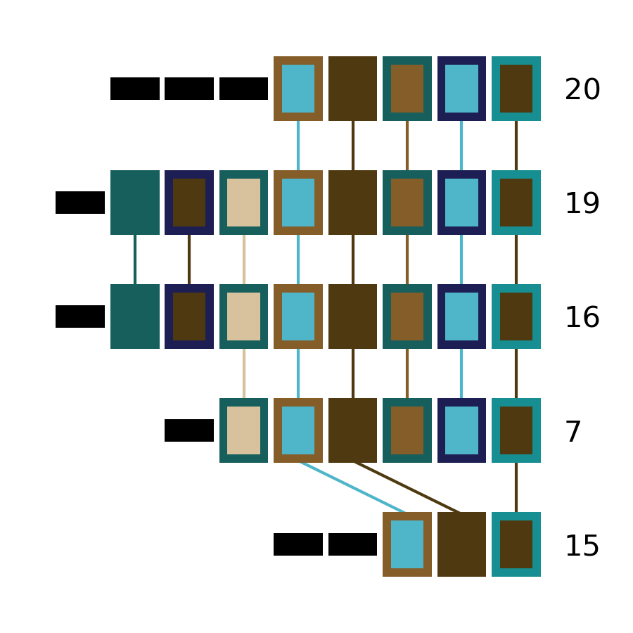
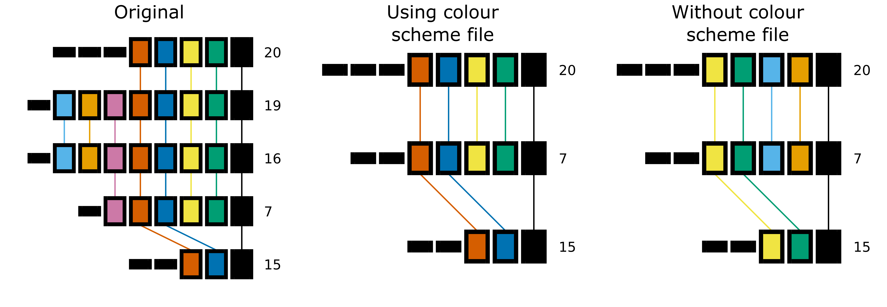
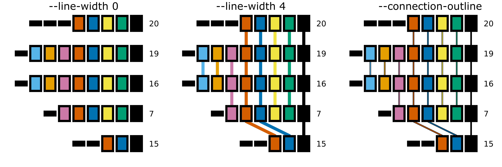

CRISPRdiff
==========

Introduction
------------

``cctk crisprdiff`` is a visualization tool to explore the relationships between CRISPR arrays. It draws arrays as a sequence of rectangles where spacers that are unique to a single array are represented by small, black rectangles, while spacers present in multiple arrays are represented by larger rectangles with a fill and outline colour combination that is unique to that spacer. Spacers that are present in two arrays drawn next to each other are connected by a line to highlight this relationship. The colour of the line connecting spacers present in two arrays is the same as the fill colour of the spacers.

This representation is intended to highlight where and what the similarities are between a group of arrays, and is therefore best suited to sets of related arrays.

.. _diff-before-you-run:

Before you run
--------------

``cctk crisprdiff`` requirs only an :ref:`array-ids` or :ref:`array-seqs` file as input. By default, all arrays present in the input file will be drawn. However, if not all of the arrays are related to one another the resulting plot will be harder to interpret (busy plot, harder to assign visually distinct colours to spacers). It is therefore recommended that you run ``cctk crisprdiff`` only on smaller batches of your arrays that share spacers.

If you identified CRISPR arrays using ``cctk minced`` or ``cctk blast``, you will have a :ref:`array-network` file among the output of those tools. This file can be visualized using a network visualization tool such as `cytoscape <https://cytoscape.org/download.html>`_ and clusters of related arrays can be selected easily. See the section :ref:`network-tutorial` for an example of how this workflow may look.

.. _diff-basic:

Basic Usage
-----------

``cctk crisprdiff`` requires two command line inputs: an :ref:`array-ids` (or :ref:`array-seqs`) file using ``-a``, and the name of the desired output file using ``-o``.

.. code-block:: shell
	
	cctk crisprdiff -a <Array_IDs.txt> -o <output plot with desired extension>

**N.B.** ``cctk crisprdiff`` uses `matplotlib <https://matplotlib.org/>`_ to perform all plotting functions. You can specify the format of the output file by providing a filename with an extension corresponding to the desired file format. E.g. out_file.png will produce a PNG format file, while out_file.svg will produce an SVG format file. Any file format compatible with `matplotlib.pyplot.savefig() <https://matplotlib.org/stable/api/_as_gen/matplotlib.pyplot.savefig.html>`_ should work.

Output files
------------

.. _diff-output:

CRISPRdiff plot
^^^^^^^^^^^^^^^

``cctk crisprdiff``'s main output is a plot representing the relationships of a set of arrays. An example of this plot is shown below and the main visual elements are highlighted.

.. image:: images/diffplot_eg.png

Each row of rectangles in the plot corresponds to an array. Spacers in each array are plotted in the same order as the appear on the corresponding line in the input file. In addition, 4 features of the plot are highlighted with red circles. Below is a description of these 4 elements:

1. The ID of the array being plotted. This is whatever the first column of the input file contains.

2. A spacer that is unique to a single array being plotted. Unique spacers are all plotted as identical small, black rectangles. **N.B.** Spacers are determined to be unique soley based on the arrays selected for plotting. A spacer drawn as a thin, black rectangle may be present in other arrays in your dataset that are not included in the plot.

3. A spacer that is found in more than one array. When spacers are drawn as large rectangles with non-black fill colour, the combination of fill and outline colour can be used to identify other instances of the same spacer in other arrays. For small numbers of different spacers found in multiple arrays black outline is used. When the number of spacers found in multiple arrays is large, a combination of the same set of colours is used for fill and outline colour.

4. When two arrays that are plotted adjacently share a spacer, a line is drawn connecting the two instances of that spacer to improve the visibility of this relationship. The colour of this line is the same as the fill colour of the spacer.

The above example plot was produced using the following data generated using ``cctk evolve`` (Array order has been adjusted to correspond between the plot and below data for clarity, but will not necessarily in practice)

.. code-block:: shell

	20	16 13 9 5 4 3 2 1
	19	21 15 12 6 5 4 3 2 1
	16	18 15 12 6 5 4 3 2 1
	7	11 6 5 4 3 2 1
	15	17 8 5 4 1

Colour scheme file
^^^^^^^^^^^^^^^^^^

``cctk crisprdiff`` can optionally output a JSON format file detailing the colours asigned to each spacer. This file can be provided to ``cctk crisprdiff``, ``cctk crisprtree``, and ``cctk constrain`` to ensure that spacers are coloured consistently between plots.

See :ref:`CRISPRdiff-json` for details.

.. _diff-advanced:

Advanced Usage
--------------

Specifying which arrays to plot
^^^^^^^^^^^^^^^^^^^^^^^^^^^^^^^^^^

If you do not wish to plot all arrays in your input file, you can specify the subset to be plotted by adding them as a list at the end of your command. This is a positional input that must come after all other inputs. E.g.:

.. code-block:: shell

	cctk crisprdiff -a <Array_IDs.txt> -o <output plot> 1 2 5 8 20 7

Specifying array order in plot
^^^^^^^^^^^^^^^^^^^^^^^^^^^^^^

Automatic ordering
""""""""""""""""""

``cctk crisprdiff`` attempts to find the best order for displaying a set of arrays by maximizing the number of spacers shared between adjacently plotted arrays. for 8 or fewer arrays, all orders will be tried and the best chosen. For 9 or more arrays, a search will be conducted to find a good order.

The number of orders that are tried during the search for a good plotting order can be controlled with ``--iterations`` (default: 10). More iterations will increase run time, but may result in a better ordering. 

Manual ordering
"""""""""""""""

You can control the order of arrays in the output plot either precisely or approximately. If you know exactly the order in which you want the arrays to be plotted, you can declare that using ``--preordered``. When using ``--preordered``, the arrays to be plotted must be listed at the end of the command in the desired order from top to bottom of the output plot. E.g. for the example plot above, array order would be specified as ``20 19 16 7 15``.

If you have an approximate order, but would like CRISPRdiff to check similar orders, use ``--approx-ordered``. This may be useful if you are, for example, plotting two sets of unrelated arrays in the same plot and would like the order within each set to be determined for you. As with ``--preordered``, you must specify the approximate order you would like by listing the arrays to be plotted (in order) at the end of the command.

Controlling plot colours
^^^^^^^^^^^^^^^^^^^^^^^^

Controlling random assignment of colours
""""""""""""""""""""""""""""""""""""""""

When using a built-in or user-provided colour scheme, and when assigning random colour combinations to large numbers of spacers, the ``random`` module for python is used. You can exert some control over the assignment of colours by setting the ``--seed`` that controls random processes. And example of when this is useful is if you do not need specific spacers to have specific colours, but would like to shuffle colours around to avoid similar colours being close together.

Providing your own colour scheme
""""""""""""""""""""""""""""""""

``cctk`` uses a single built-in colour scheme, described by `Wong, 2011 <https://www.nature.com/articles/nmeth.1618>`_ that is colour blind-friendly and has high visual contrast between colours. However, you can use custom colours as well using ``--colour-file``. 

To define a custom colour scheme, simply create a text file containing hex code definitions of the colours, 1 per line. Below is an example of what such a file looks like using the Isfahan1 colour scheme from the `MetBrewer R package <https://github.com/BlakeRMills/MetBrewer/blob/main/R/PaletteCode.R>`_

.. code-block:: shell

	#4e3910
	#845d29
	#d8c29d
	#4fb6ca
	#178f92
	#175f5d
	#1d1f54

That colour scheme, used to visualize the same arrays as the plot in the :ref:`diff-output` section, looks like this

.. _CRISPRdiff-json:

Consistent colour schemes between ``cctk`` tools
""""""""""""""""""""""""""""""""""""""""""""""""

The ``cctk`` tools ``CRISPRdiff``, ``CRISPRtree``, and ``contrain`` have the option to save and load spacer colour assignments to allow consistent colour schemes between different visual representations of the same arrays. This feature can be used for any plots containing at least 1 of the same spacers, even if the set of spacers in each plot is not entirely the same (**N.B** When colours are set this way, any colour combinations assigned to a spacer that is not present in the analysis are still reserved and will not be used for other spacers.)

To save the colour scheme used in a plot by any of these tools, use ``--colour-scheme-outfile`` and provide the path (and filename) to which the file should be written. A saved colour scheme file can then be provided for use in future plots using ``--colour-scheme-infile``.

To illustrate the functionality of these options, three CRISPRdiff plots are shown below. The first is the same set of arrays shown in the plot in the :ref:`diff-output` section. The colour scheme used to generate this plot was saved using ``--colour-scheme-outfile``. The other two plots represent a subset of those arrays that does not include the two arrays (19 and 16) which contain the cyan and orange spacers on the left of the plot (Also note that the pink spacer present in arrays 19, 16, and 7 is no longer coloured as it is now only present in array 7.) The second plot was generated using ``--colour-scheme-infile`` resulting in spacer colours that correspond to the first plot. The third plot was generated without providing a colour scheme file and so spacer colour assignments do not correspond to those in the other two plots.

Controlling plot elements and size
^^^^^^^^^^^^^^^^^^^^^^^^^^^^^^^^^^

Connecting-line appearance
""""""""""""""""""""""""""

The appearance of the lines connecting identical spacers in adjacently plotted arrays have two customizable attributes: line-width (``--line-width``) and an optional outline colour (``--connection-outline``).

``--line-width`` can be used to make connection lines thicker by poviding a number larger than the default of 1.0. Connecting lines can also be removed by setting this value to 0.

``--connection-outline`` can be used to add a thicker line behind the default line. The added thicker line has the colour of the outline colour assigned to the connected spacer, while the default thin line is coloured by the fill colour assigned to the connected spacers. This can add visual contrast to similarly coloured lines, but results in a busier appearance. The thickness of both of these lines can be controlled by ``--line-width``. See below for an example of how these options change the appearance of the plot.

Plot size and resolution
""""""""""""""""""""""""

The size and resolution of plots produced by ``CRISPRdiff`` can be controlled using command line options. These options can be used to generate images of the exact specification required for a figure, or may be necessary to create a sensibly scaled image (see :ref:`diff-limitations`).

Plot height and width can be set using the options ``--plot-width`` and ``--plot-height`` and providing the desired size in inches.

pixel density (DPI) can be set using ``--dpi``. As connecting lines between identical spacers can be slanted, a resolution of at least 600 DPI is recommended (and is the default value), while 1200 should result in lines with no visible pixels. The images on this page were generated at 600 DPI. **N.B.** DPI settings are only relevant for images generated by ``CRISPRdiff`` in raster formats such as PNG. SVG outputs are unaffected by DPI settings provided to ``CRISPRdiff``.

``--font-size`` can be used to control the size of text in the plot (default value is 10pt). 

.. _diff-limitations:

Limitations and considerations
------------------------------

Sequence blindness
^^^^^^^^^^^^^^^^^^

``CRISPRdiff`` pays no attention to similarities in the sequences of spacers being plotted. All spacers are treated as characters that are either identical or different. If you would like spacers to be assigned the same colour based on some level of similarity (e.g. if they differ at fewer than 2 bases), then you need to adjust your input files accordingly. A single base difference in the sequence of two spacers will result in ``CRISPRdiff`` considering those two spacers as distinct.

Plot scaling for tall or wide plots
^^^^^^^^^^^^^^^^^^^^^^^^^^^^^^^^^^^

``CRISPRdiff`` was designed with the creation of figures of defined dimensions and resolution in mind. The produced plot is therefore scaled to fill the provided dimensions. The default plot size works well for a small number (5-8) of arrays of moderate length (5-20 spacers). However, for large number of arrays or for very long arrays, plot elements may appear squashed or small as an attempt is made to keep spacer shape dimensions roughly proportional. If you are plotting a large number of arrays or very long arrays, you will need to adjust the plot dimensions accordingly or output an SVG plot and scale plot elements in a graphical editor software.

Colour blindness and colour schemes
^^^^^^^^^^^^^^^^^^^^^^^^^^^^^^^^^^^

`Colour blindness affects a considerable proportion of people worldwide <https://en.wikipedia.org/wiki/Color_blindness#Epidemiology>`_ and is therefore an important consideration when designing visualizations of data. CCTK tools use a colour scheme `presented by Bang Wong <https://www.nature.com/articles/nmeth.1618>`_ which provides good visual contrast and is accessible to colour blind individuals. 

However, colour blind-friendly palettes are, by their nature, limited. The default CCTK colour scheme can colour up to 64 distinct spacers. For larger numbers of spacers, CCTK will automatically generate random colour pairs to use, but these randomly generated colours are unlikely to be colour blind-friendly.

Some good sources of alternative colour palettes that can be easily provided to CCTK tools are:

`colorbrewer <https://colorbrewer2.org/>`_
	
	* Small number of colour blind-friendly options
	* Hex codes provided

`Metbrewer <https://github.com/BlakeRMills/MetBrewer>`_

	* Visually appealing colour palettes based on works of art
	* Colour blind-friendly options

`Davidmathlogic blog <https://davidmathlogic.com/colorblind/>`_

	* Small selection of colour blind-friendly palettes
	* Useful utility for testing colour combinations and seeing a representation of their appearance with different kinds of colour blindness

`iwanthue <http://medialab.github.io/iwanthue/>`_ 
	
	* "Colorblind friendly" Color space option
	* analysis of extent to which each produced colour is visually distinct with different colour blindness types
	* One hex code colour per line format that can be copied into a file and given to CCTK ("Hex list for CSS")
