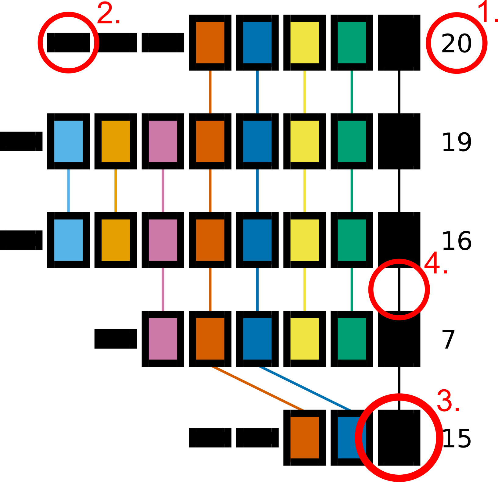

CRISPRdiff
==========

Introduction
------------

``cctk CRISPRdiff`` is a visualization tool to explore the relationships between CRISPR arrays. It draws arrays as a sequence of rectangles where spacers that are unique to a single array are represented by small, black rectangles, while spacers present in multiple arrays are represented by larger rectangles with a fill and outline colour combination that is unique to that spacer. Spacers that are present in two arrays drawn next to each other are connected by a line to highlight this relationship. The colour of the line connecting spacers present in two arrays is the same as the fill colour of the spacers.

This representation is intended to highlight where and what the similarities are between a group of arrays, and is therefore best suited to sets of related arrays.

.. _diff-before-you-run:

Before you run
--------------

``cctk CRISPRdiff`` requirs only an :ref:`array-ids` or :ref:`array-seqs` file as input. By default, all arrays present in the input file will be drawn. However, if not all of the arrays are related to one another the resulting plot will be harder to interpret (busy plot, harder to assign visually distinct colours to spacers). It is therefore recommended that you run ``cctk CRISPRdiff`` only on smaller batches of your arrays that share spacers.

If you identified CRISPR arrays using ``cctk minced`` or ``cctk blast``, you will have a :ref:`array-network` file among the output of those tools. This file can be visualized using a network visualization tool such as `cytoscape <https://cytoscape.org/download.html>`_ and clusters of related arrays can be selected easily. See :ref:`diff-example` for an example of how this workflow may look.

.. _diff-basic:

Basic Usage
-----------

``cctk CRISPRdiff`` requires two command line inputs: an :ref:`array-ids` (or :ref:`array-seqs`) file using ``-i``, and the name of the desired output file using ``-o``.

.. code-block:: shell
	
	cctk CRISPRdiff -i <Array_IDs.txt> -o <Output plot with desired extension>

**N.B.** ``cctk CRISPRdiff`` uses matplotlib to perform all plotting functions. You can specify the format of the output file by providing a filename with an extension corresponding to the desired file format. E.g. out_file.png will produce a PNG format file, while out_file.svg will produce an SVG format file. Any file format compatible with `matplotlib.pyplot.savefig <https://matplotlib.org/stable/api/_as_gen/matplotlib.pyplot.savefig.html>`_ should work.

Output files
------------

CRISPRdiff plot
^^^^^^^^^^^^^^^

``cctk CRISPRdiff``'s main output is a plot representing the relationships of a set of arrays. An example of this plot is shown below and the main visual elements are highlighted.

Each row of rectangles in the plot corresponds to an array. Spacers in each array are plotted in the same order as the appear on the corresponding line in the input file. In addition, 4 features of the plot are highlighted with red circles. Below is a description of these 4 elements:

1. The ID of the array being plotted. This is whatever the first column of the input file contains.

2. A spacer that is unique to a single array being plotted. Unique spacers are all plotted as identical small, black rectangles. **N.B.** Spacers are determined to be unique soley based on the arrays selected for plotting. A spacer drawn as a thin, black rectangle may be present in other arrays in your dataset that are not included in the plot.

3. A spacer that is found in more than one array. When spacers are drawn as large rectangles with non-black fill colour, the combination of fill and outline colour can be used to identify other instances of the same spacer in other arrays. For small numbers of different spacers found in multiple arrays black outline is used. When the number of spacers found in multiple arrays is large, a combination of the same set of colours is used for fill and outline colour.

4. When tow are arrays that are plotted adjacently share a spacer, a line is drawn connecting the two instances of that spacer to improve the visibility of this relationship. The colour of this line is the same as the fill colour of the spacer.

The above example plot was produced using the following data generated using ``cctk evolve`` (Array order has been adjusted to correspond between the plot and below data for clarity, but will not necessarily in practice)

.. code-block:: shell

	20	16 13 9 5 4 3 2 1
	19	21 15 12 6 5 4 3 2 1
	16	18 15 12 6 5 4 3 2 1
	7	11 6 5 4 3 2 1
	15	17 8 5 4 1

.. _diff-advanced:

Advanced Usage
--------------

Specifying array order in plot
^^^^^^^^^^^^^^^^^^^^^^^^^^^^^^

.. _diff-limitations:

Limitations and considerations
------------------------------

.. _diff-example:

Worked example
--------------
