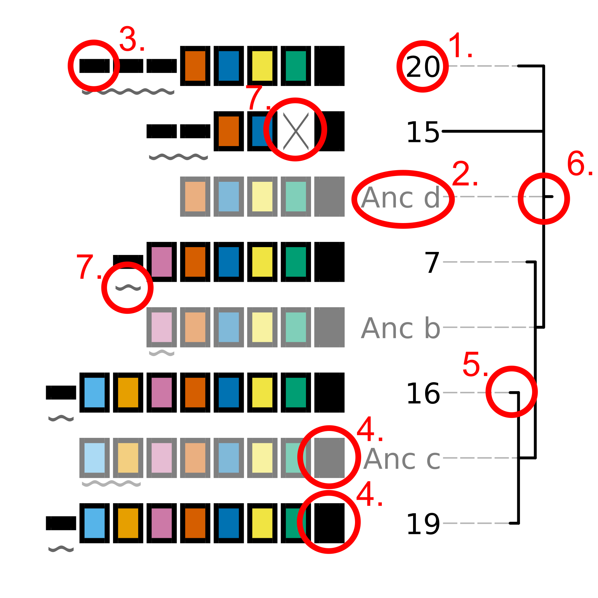
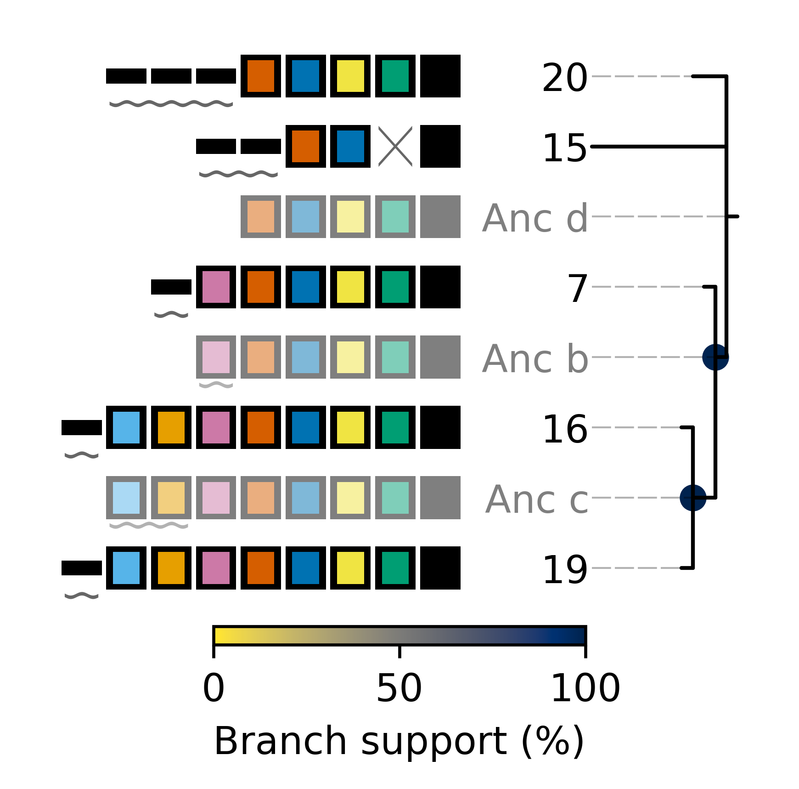
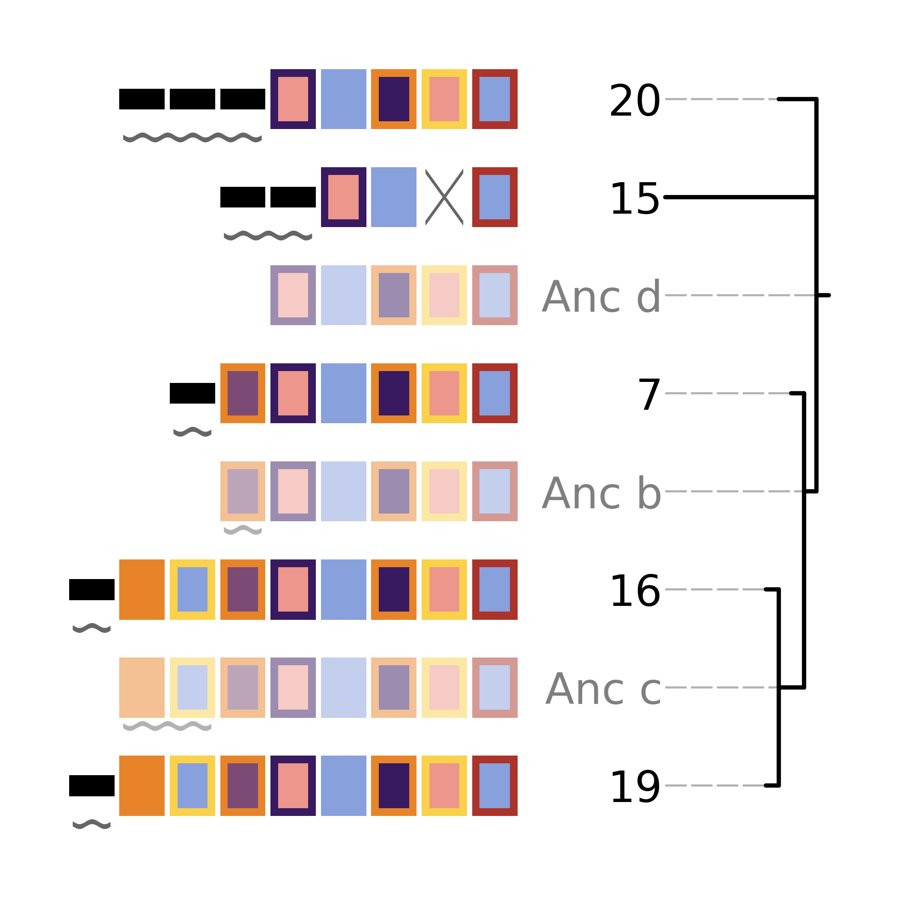
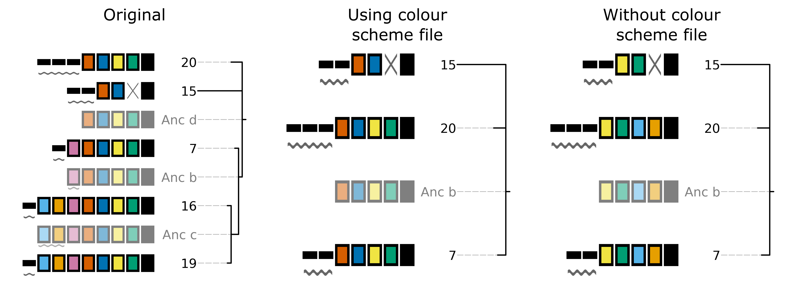
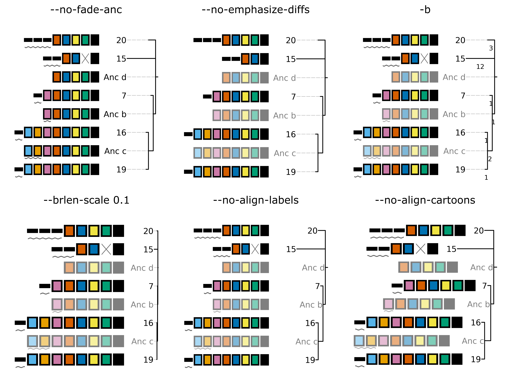

CRISPRtree
==========

Introduction
------------

``cctk CRISPRtree`` uses a maximum parsimony approach to create a tree representation of the relationship between a set of arrays. It produces a visualization of this hypothesis that indicates how arrays are related to one another and which events may have occurred in each array since an ancestral state. Branch lengths in the tree correspond to the weighted parsimony cost between an array and its hypothetical ancestor. All arrays (both input, extant arrays, and hypothetical ancestral arrays) are depicted in the same style as ``cctk CRISPRdiff``. In addition, any events that are hypothesized to have occurred in an array since its ancestor are indicated using symbols corresponding to the :ref:`tree-key`. The process by which ``cctk CRISPRtree`` constructs trees is discussed in the :ref:`tree-process` section.

.. _tree-before-you-run:

Before you run
--------------

``cctk CRISPRtree`` requirs only an :ref:`array-ids` or :ref:`array-seqs` file as input. By default, all arrays present in the input file will be analyzed. However, ``cctk CRISPRtree`` requires that all input arrays are related to one another (i.e., all arrays are part of a single cluster in a network representation of their relationships) if not all of the arrays are related to one another the resulting plot will be harder to interpret (busy plot, harder to assign visually distinct colours to spacers). It is therefore recommended that you run ``cctk CRISPRtree`` only on smaller batches of your arrays that share spacers.

If you identified CRISPR arrays using ``cctk minced`` or ``cctk blast``, you will have a :ref:`array-network` file among the output of those tools. This file can be visualized using a network visualization tool such as `cytoscape <https://cytoscape.org/download.html>`_ and clusters of related arrays can be selected easily. See the section :ref:`network-tutorial` for an example of how this workflow may look.

.. _tree-basic:

Basic Usage
-----------

``cctk CRISPRtree`` requires two command line inputs: an :ref:`array-ids` (or :ref:`array-seqs`) file using ``-a``.

.. code-block:: shell
	
	cctk CRISPRtree -a <Array_IDs.txt>

The above command will produce a newick string for the most parsimonious tree(s), but will not produce a graphical represenation of the tree. To save a graphical representation of the most parsimonious tree(s) to a file, you must provide a destination filename using ``-o``. e.g.

.. code-block:: shell

	cctk CRISPRtree -a <Array_IDs.txt> -o <output plot with desired extension>

**N.B.** ``cctk CRISPRtree`` uses `matplotlib <https://matplotlib.org/>`_ to perform all plotting functions. You can specify the format of the output file by providing a filename with an extension corresponding to the desired file format. E.g., out_file.png will produce a PNG format file, while out_file.svg will produce an SVG format file. Any file format compatible with `matplotlib.pyplot.savefig() <https://matplotlib.org/stable/api/_as_gen/matplotlib.pyplot.savefig.html>`_ should work.

Outputs
-------

``cctk CRISPRtree`` produces outputs both to specified file locations (depending on command line options specified) and to the ``stdout`` and ``stderr`` as described below.

.. _tree-plot:

Tree plot
^^^^^^^^^

If ``cctk CRISPRtree`` is run with ``-o``, a graphical representation of the most parsimonious tree(s) will be saved to the specified file path. If more than one equally parsimonious tree is found to have the best parsimony score, then they will be saved to separate files which are derived from the specified filename through the addition of '_1', '_2' etc before the file extension. E.g., given the output file 'output/tree_image.png', two equally parsimonious trees would be saved to 'output/tree_image_1.png' and 'output/tree_image_2.png'.

An example tree plot is show below. This tree was generated using the same arrays as were used for the :ref:`diff-output` example plots. i.e.,

.. code-block:: shell

	20      16 13 9 5 4 3 2 1
	19      21 15 12 6 5 4 3 2 1
	16      18 15 12 6 5 4 3 2 1
	7       11 6 5 4 3 2 1
	15      17 8 5 4 1

The tree topology on the right of the plot indicates the hypothetical relationship between the plotted arrays. Each input array as well as each hypothetical ancestral array is represented in the same style as that used in the :ref:`diff-output`. Key visual elements of the tree plot, corresponding to the numbers in the above image, are described below:

1. The ID of the array being plotted. Input arrays use the ID that was present in the input file provided using ``-a``.

2. The ID of a hypothetical ancestral array. Ancestral arrays are assigned identifiers beginning with "Anc" (abbreviated from ancestral) and a letter identifier. If more than 26 ancestral states are predicted, then two letter idetnfiers will be used. Ancestral array leaf labels and array cartoons are plotted with slight transparency to provide visual contrast with input arrays.

3. Spacers that are only present in a single input array are represented using a thin, black rectangle. Importantly, the presence of a spacer in an input array AND a hypothetical ancestral array is not sufficient for that spacer to be assigned a colour. The presence of a spacer in an ancestral array is not considered when choosing how to represent the spacer.

4. Spacers that are present in more than one input array are represented using thick rectangles. Each combination of fill and outline colour corresponds to each unique spacer. Note that hypothetical ancestral arrays are depicted using slight transparency to distinguish them from input arrays.

5. The relationships between the arrays being analyzed is represented as a tree. Branch lengths correspond to the weighted parsimony cost of all events that are predicted to have occurred between each array and its hypothetical ancestral array.

6. The root of the tree corresponds to the array that ``cctk CRISPRtree`` hypothesizes is the last common ancestor of all the arrays being considered. The spacers shown in this array are not necessarily all the spacers that would have been present in this array, but are all the spacers for which ``cctk CRISPRtree`` has evidence.

7. Events that ``cctk CRISPRtree`` hypothesizes may have occurred between each array and its hypothetical ancestor are indicated using symbols that correspond to the :ref:`tree-key`. Acquisition and duplication events are indicated with symbols that are placed below the acquired or duplicated spacers. Deletions and trailer loss events are indicated with symbols in-place of the lost spacers. insertions, no identity, and redundant gain events are indicated with a box that surrounds all spacers that are hypothesized to have been involved in the inicated event.

.. _tree-key:

CRISPRtree event key
^^^^^^^^^^^^^^^^^^^^

Events that CRISPRtree can hypothesize are shown in the below key.

.. image:: images/tree_key.png

stdout
^^^^^^

Newick format tree strings are written to the stdout. If multiple, equally parsimonious trees are found, they will be written to stdout separated with newlines.

stderr
^^^^^^

Descriptive log information is written to the stderr. This information includes that command that was used to execute ``cctk CRISPRtree``, the weighted parsimony score of the most parsimonious tree identified, and the order in which arrays were processed to create each most parsimonious tree. Array order information can be used to recreate the same tree with different graphical settings without needing to repeat a search across many trees (as described in the :ref:`tree-fix-order` section.) 

.. _tree-advanced:

Advanced Usage
--------------

Specifying which arrays to analyze
^^^^^^^^^^^^^^^^^^^^^^^^^^^^^^^^^^

If you do not wish to analyze all arrays in your input file, you can specify the subset to be analyzed by adding them as a list at the end of your command. This is a positional input that must come after all other inputs. E.g.:

.. code-block:: shell

	cctk CRISPRtree -a <Array_IDs.txt> -o <output plot> 15 20 7 16 19

.. _tree-fix-order:

Specifying array order
^^^^^^^^^^^^^^^^^^^^^^

As described in the :ref:`tree-process` section, ``cctk CRISPRtree`` adds arrays to a growing tree one by one in a deterministic way such that a given array order will allways result in the same tree if the same parsimony weights are used. It is therefore possible to recreate the same tree in multiple executions of the ``cctk CRISPRtree`` program by specifying the order in which to add arrays. This can be done by using the ``-x`` flag and providing the desired array order at the end of the command. The ordered arrays do not need to immediately follow the ``-x`` flag as this flag simply activates the fixed order running mode.

**N.B.** Fixing array order using ``-x`` overrides the ``-r`` setting. If you specify a number of replicates using ``-r`` this will be ignored and only a single tree will be made.

**N.B.2** If you specify array order with ``-x`` but also change any of the parsimony cost settings, the output tree may change.

Plotting ascii representation of tree
^^^^^^^^^^^^^^^^^^^^^^^^^^^^^^^^^^^^^

Tree topologies can be assessed quickly in the terminal using the ``--print-tree`` flag. For example, the tree shown in the :ref:`tree-plot` section is represented as shown below:

.. code-block:: shell

                                                       /------------------------- 19
                             /-------------------------Anc c
    /------------------------Anc b                     \------------------------- 16
    |                        |
    |                        \--------------------------------------------------- 7
    Anc d
    |---------------------------------------------------------------------------- 15
    |
    \---------------------------------------------------------------------------- 20

Saving hypothetical ancestral arrays
^^^^^^^^^^^^^^^^^^^^^^^^^^^^^^^^^^^^

``cctk CRISPRtree`` produces hypothetical ancestral arrays that that contain a subset of the spacers present in the input arrays. These arrays can be saved to an output file using ``--output-arrays <filename>``.

Calculating branch support
^^^^^^^^^^^^^^^^^^^^^^^^^^

Branch support calculation approach
"""""""""""""""""""""""""""""""""""

``cctk CRISPRtree`` finds the most parsimonious tree by constructing many trees and comparing their parsimony cost. Each tree is the result of adding arrays to a growing tree in different orders as described in the :ref:`tree-process` section. The order in which arrays are added determines the final topology in large part by determining the ancestral arrays that are inferred (as ancestral arrays are not changed once created). However, while overall topologies may differ between each replicate of the tree-building process, highly similar arrays may still be consistently placed together. ``cctk CRISPRtree`` therefore assesses the frequency with which a given node is seen in all of the trees produced during the tree-building process.

In order to score the presence or absence of nodes, each node is assigned a binary identifier that describes the leaves that descend from it. For example, given the following most parsimonious tree:

.. code-block:: shell

	                                                   /------------------------- 4
	                         /-------------------------c
	/------------------------b                         \------------------------- 3
	|                        |
	a                        \--------------------------------------------------- 2
	|
	\---------------------------------------------------------------------------- 1

We begin by assigning each leaf a binary identifier. There are 4 leaves so they are assigned IDs as follows:

.. code-block:: shell

	1	1000
	2	0100
	3	0010
	4	0001

We can then assign an identifier to each internal node (a, b, and c) describing which nodes descend from that node (i.e., the sum of the IDs of leaves descended from the node). This can be thought of by considering each position in the 4 digit ID as a presence/absence of the corresponding leaf. The first position indicates the presence of array 1 as a leaf, the second array 2 etc. Node a has all four leaves as its descendents so it is assigned an ID that is the sum of the IDs of those leaves: 1000 + 0100 + 0010 + 0001 = 1111. Node b has arrays 2, 3, and 4 so it's ID is 0111. Node c has arrays 3 and 4 so its ID is 0011.

Having identified the nodes present in the most parsimonious tree, we then assign binary IDs to all internal nodes in all other trees and count the number of times each ID in our most parsimonious tree is seen. For example, given the following not very parsimonious tree:

.. code-block:: shell

	                                                   /------------------------- 4
	/--------------------------------------------------b
	|                                                  \------------------------- 3
	a
	|                                                  /------------------------- 2
	\--------------------------------------------------c
	                                                   \------------------------- 1

The IDs for the three internal nodes are a: 1111, b: 0011, c: 1100. We then search this list for any of the IDs from our most parsimonious tree and add to the count of those IDs. 1111 is seen (the ID of the root node is always present in every tree as every tree contains every leaf), and so is 0011, while 0111 is absent. Therefore, after this first tree the counts are 1111: 1, 0111: 0, 0011: 1. This process is repeated for all the trees that were generated during this run. The count is then divided by the number of trees checked to produce a percent branch support value.

Adding branch support to your tree
""""""""""""""""""""""""""""""""""

branch support calculation is activated by the inclusion of ``--branch-support``. The number of trees used in the branch support calculation is determined by the number of replicated set using ``-r`` (default = 100).

.. code-block:: shell

	cctk CRISPRtree -a <Array_IDs.txt> -o <output plot> -r <num replicates> --branch-support

Adding branch support to the tree shown in the :ref:`tree-plot` section with 100 replicates produces the below image. Branch support is indicated at each internal node (except the root) using a coloured circle. ``cctk CRISPRtree`` uses the colour map `cividis <https://doi.org/10.1371/journal.pone.0199239>`_ for which a colour key is added to the bottom of the image.

In addition to adding the branch support to the produced tree plot, branch support values are added to the produced newick string as well. For example, the above tree has the following newick string:

.. code-block:: shell

	(((19:1.0,16:1.0)Anc_c:2.0[100],7:1.0)Anc_b:1.0[99],15:12.0,20:3.0)Anc_d:0.0

Branch support values are shown as, e.g., [100] next to the corresponding internal node ID. For example, Anc_c has 100% support, while Anc_b has 99% support. This newick string can be easily used with other tree visualization software such as `iToL <https://itol.embl.de/itol.cgi>`_.

Controlling plot colours
^^^^^^^^^^^^^^^^^^^^^^^^

Controlling random assignment of colours
""""""""""""""""""""""""""""""""""""""""

When using a built-in or user-provided colour scheme, and when assigning random colour combinations to large numbers of spacers, the ``random`` module for python is used. You can exert some control over the assignment of colours by setting the ``--seed`` that controls random processes. And example of when this is useful is if you do not need specific spacers to have specific colours, but would like to shuffle colours around to avoid similar colours being close together.

Providing your own colour scheme
""""""""""""""""""""""""""""""""

``cctk`` uses a single built-in colour scheme, described by `Wong, 2011 <https://www.nature.com/articles/nmeth.1618>`_ that is colour blind-friendly and has high visual contrast between colours. However, you can use custom colours as well using ``--colour-file``. 

To define a custom colour scheme, simply create a text file containing hex code definitions of the colours, 1 per line. Below is an example of what such a file looks like using the Archambault colour scheme from the `MetBrewer R package <https://github.com/BlakeRMills/MetBrewer/blob/main/R/PaletteCode.R>`_

.. code-block:: shell

	#88a0dc
	#381a61
	#7c4b73
	#ed968c
	#ab3329
	#e78429
	#f9d14a

That colour scheme, used to visualize the same arrays as the plot in the :ref:`tree-plot` section, looks like this

.. _CRISPRtree-json:

Consistent colour schemes between ``cctk`` tools
""""""""""""""""""""""""""""""""""""""""""""""""

The ``cctk`` tools ``CRISPRdiff``, ``CRISPRtree``, and ``contrain`` have the option to save and load spacer colour assignments to allow consistent colour schemes between different visual representations of the same arrays. This feature can be used for any plots containing at least 1 of the same spacers, even if the set of spacers in each plot is not entirely the same (**N.B** When colours are set this way, any colour combinations assigned to a spacer that is not present in the analysis are still reserved and will not be used for other spacers.)

To save the colour scheme used in a plot by any of these tools, use ``--colour-scheme-outfile`` and provide the path (and filename) to which the file should be written. A saved colour scheme file can then be provided for use in future plots using ``--colour-scheme-infile``.

To illustrate the functionality of these options, three CRISPRtree plots are shown below. The first is the same set of arrays shown in the plot in the :ref:`tree-plot` section. The colour scheme used to generate this plot was saved using ``--colour-scheme-outfile``. The other two plots represent a subset of those arrays that does not include the two arrays (19 and 16) which contain the cyan and orange spacers on the left of the plot (Also note that the pink spacer present in arrays 19, 16, and 7 is no longer coloured as it is now only present in array 7.) The second plot was generated using ``--colour-scheme-infile`` resulting in spacer colours that correspond to the first plot. The third plot was generated without providing a colour scheme file and so spacer colour assignments do not correspond to those in the other two plots.

Controlling plot elements and size
^^^^^^^^^^^^^^^^^^^^^^^^^^^^^^^^^^

Plot element control
""""""""""""""""""""

Several visual elements of the plot produced by ``cctk CRISPRtree`` can be controlled using command line options. An illustration of the effect of these options is shown in the image below.

The default behaviour of ``cctk CRISPRtree`` is to de-emphasize ancestral arrays by applying transparency to their node labels and array cartoons. This can be disabled using the ``--no-fade-anc`` option.

The default behaviour of ``cctk CRISPRtree`` is to annotate hypothetical events onto arrays. This can be disabled using the ``--no-emphasize-diffs`` option.

The inclusion of branch length annotations can be controlled using ``-b``. Branch lengths correspond to the weighted parsimony cost of events between an array and its ancestor. Branch length labels are added at the midpoint of the corresponding branch.

Branch lengths can be scaled by a (floating point number) factor provided using ``--brlen-scale``. This can be used to increase or decrease all branch lengths. Horizontal space taken up by branches in the tree reduces the space available for CRISPR array cartoons so this option can be used to control the amount of space in the plot used by those two components.

The default behaviour of ``cctk CRISPRtree`` is to align node labels and array cartoons. Label alignment can be deactivated using ``--no-align-labels``. The alignment of both cartoons and labels can be deactivated using ``--no-align-cartoons``. Note that it is not possible to deactivate the alignment of array cartoons without also deactivating the alignment of labels.

Plot size and resolution
""""""""""""""""""""""""

The size and resolution of plots produced by ``cctk CRISPRtree`` can be controlled using command line options. These options can be used to generate images of the exact specification required for a figure, or may be necessary to create a sensibly scaled image (see :ref:`tree-limitations`).

Plot height and width can be set using the options ``--plot-width`` and ``--plot-height`` and providing the desired size in inches.

pixel density (DPI) can be set using ``--dpi``. The images on this page were generated at 600 DPI. **N.B.** DPI settings are only relevant for images generated by ``cctk CRISPRtree`` in raster formats such as PNG. SVG outputs are unaffected by DPI settings.

``--font-size`` can be used to control the size of text in the plot (default value is 10pt).

.. _tree-process:

CRISPRtree tree-making process
------------------------------

Briefly, ``cctk CRISPRtree`` constructs a tree of CRISPR array relationships by adding arrays into a growing bifurcating tree one by one, and generating hypothetical ancestors at internal nodes. Tree topology is determined by a combination of the relationships between arrays and the order in which they are added to the tree. The order in which arrays are added to the tree are shuffled in order to generate different topologies and the topology with the lowest weighted parsimony cost is considered the best.

The process used by ``cctk CRISPRtree`` to construct a tree of CRISPR array relationships and generate hypothetical ancestors is as follows for a given ordered list of arrays to be analyzed:

1. Identify stretches of spacers (called "modules" here) that are shared and distinct between the first two arrays in the list:

   a. Align the two spacers
   b. Identify stretches of shared spacers
   c. Differences on the closer to the leader end of each array than the first shared spacers are characterized as leader differences.
   d. Differences after the first shared spacer are characterized as indels

2. Process spacer modules to generate hypothetical ancestor

   a. Keep all shared spacers
   b. Discard leader-end differences
   c. For indels, behaviour depends on the following:

      * If one array has spacers and the other doesn't, keep the spacers (deletion more likely than insertion)
      * If both arrays have spacers not present in the other, search other arrays not yet added to the tree. If another array has all these spacers, use that array to determine the order of the modules. Otherwise keep them both in a random order.
      * If only one array's spacers are found in another array, keep those spacers and discard the others
      * If both array's spacers are found in different arrays, but not together, then keep one at random and discard the other (no evidence that these spacers existed in the same array)

3. Create starting tree with the two arrays as descendents of their hypothetical ancestor

4. Select the next array (called "query array" here) in the list and identify its closest match in the tree. For each array already added to the tree:
   a. align the query array to each array in the tree (including hypothetical ancestors)
   b. identify modules as above
   c. quantify similarity by adding together to weighted parsimony cost of each module (e.g., 4 leader end spacer differences = 4 acquisitions. A region of spacers present in one array but not the other = 1 deletion)
   d. Once the closest match is found, repeat steps 1 and 2 to generate a hypothetical ancestor.
   e. The query array, and its closest match are set as descendents of their hypothetical ancestor. This subtree replaces the node in the tree corresponding to the closest match.

5. Repeat until all arrays have been added to the tree

6. Compare all hypothetical ancestors to their ancestors. If any are identical (i.e., branch length = 0), collapse them to a polytomy

7. Assess all of the indel and leader-end acquisition events predicted in each array. If any contain spacers not found in that array's ancestor, but found elsewhere in the tree, recharacterize those events are repeated indels and adjust parsimony score.

.. _tree-limitations:

Limitations and considerations
------------------------------

Sequence blindness
^^^^^^^^^^^^^^^^^^

``cctk CRISPRtree`` pays no attention to similarities in the sequences of spacers being plotted. All spacers are treated as characters that are either identical or different. If you would like spacers to be assigned the same colour based on some level of similarity (e.g., if they differ at fewer than 2 bases), then you need to adjust your input files accordingly. A single base difference in the sequence of two spacers will result in ``cctk CRISPRtree`` considering those two spacers as distinct.

Plot scaling for tall or wide plots
^^^^^^^^^^^^^^^^^^^^^^^^^^^^^^^^^^^

``cctk CRISPRtree`` was designed with the creation of figures of defined dimensions and resolution in mind. The produced plot is therefore scaled to fill the provided dimensions. The default plot size works well for a small number (5-8) of arrays of moderate length (5-20 spacers). However, for large number of arrays or for very long arrays, plot elements may appear squashed or small as an attempt is made to keep spacer shape dimensions roughly proportional. If you are plotting a large number of arrays or very long arrays, you will need to adjust the plot dimensions accordingly or output an SVG plot and scale plot elements in a graphical editor software.

Arrays with large numbers of deletions
^^^^^^^^^^^^^^^^^^^^^^^^^^^^^^^^^^^^^^

All tree making methods are sensetive to the level of information loss in the underlying data. Treese generated for sufficiently diverged genes are unreliable. The same is true for CRISPR array trees generated by ``cctk CRISPRtree``. ``cctk CRISPRtree`` is sensetive to deletions in CRISPR arrays. Few deletions provide information about the relationships between arrays, while many deletions can remove evidence of those relationships. As described in the manuscript associated with CCTK (link to be added after publication), ``cctk CRISPRtree`` is able to accurately reproduce the true tree when the frequency of deletions in CRISPR arrays is low. For higher levels of deletions, the true tree can still be produced frequently, depending on the extent of information loss.  `cctk evolve <evolve.html>`_ was developed to test the ability of ``cctk CRISPRtree`` to recreate the true relationships between CRISPR arrays given different rates of acquisitions, deletions, and trailer loss, as described in the manuscript associated with CCTK. `cctk evolve <evolve.html>`_ is distributed as part of CCTK and can be used to explore the ability of ``cctk CRISPRtree`` to accurately recreate CRISPR array relationships given different parameters.

Colour blindness and colour schemes
^^^^^^^^^^^^^^^^^^^^^^^^^^^^^^^^^^^

`Colour blindness affects a considerable proportion of people worldwide <https://en.wikipedia.org/wiki/Color_blindness#Epidemiology>`_ and is therefore an important consideration when designing visualizations of data. CCTK tools use a colour scheme `presented by Bang Wong <https://www.nature.com/articles/nmeth.1618>`_ which provides good visual contrast and is accessible to colour blind individuals. 

However, colour blind-friendly palettes are, by their nature, limited. The default CCTK colour scheme can colour up to 64 distinct spacers. For larger numbers of spacers, CCTK will automatically generate random colour pairs to use, but these randomly generated colours are unlikely to be colour blind-friendly.

Some good sources of alternative colour palettes that can be easily provided to CCTK tools are:

`colorbrewer <https://colorbrewer2.org/>`_
	
	* Small number of colour blind-friendly options
	* Hex codes provided

`Metbrewer <https://github.com/BlakeRMills/MetBrewer>`_

	* Visually appealing colour palettes based on works of art
	* Colour blind-friendly options

`Davidmathlogic blog <https://davidmathlogic.com/colorblind/>`_

	* Small selection of colour blind-friendly palettes
	* Useful utility for testing colour combinations and seeing a representation of their appearance with different kinds of colour blindness

`iwanthue <http://medialab.github.io/iwanthue/>`_ 
	
	* "Colorblind friendly" Color space option
	* analysis of extent to which each produced colour is visually distinct with different colour blindness types
	* One hex code colour per line format that can be copied into a file and given to CCTK ("Hex list for CSS")
