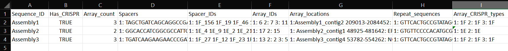

blast
=====

.. _blast-before-you-run:

Before you run
--------------

``cctk blast`` requires you to provide the sequences you wish to search in the form of a blast database. This can be acheived simply using the ``makeblastdb`` from NCBI BLAST+ command which is included in the conda installation of CCTK. However, before making your blastdb, please confirm that your sequences meet the following requirements:

#. No pipe symbols ("|") in any of your fasta headers.
#. None of the fasta headers in the sequences are the same.
#. If your sequences are broken up into multiple contigs, ensure that each fasta header contains an identifier that can be used to associate the sequences.

If you need to modify your fasta headers to add an identifier then a simple option is to add the filename to every header it contains (assuming your filenames are informative). **N.B.** It is a good idea to make a copy of your files before modifying them in case something goes wrong! 

This modification can be acheived with something like the following bash loop (run in the directory with your sequence files):

.. code-block:: shell
	
	for file in *; do id=${file%.*}; sed -i "s/>/>${id}_/" $file; done

This will add the filename (minus extension) to the beginning of each fasta header in each file.

Making a blastdb from a directory containing your sequences to search can be acheived in two steps (if you are only searching a single sequence file skip the first step). Assuming your sequences are in a directory called sequences/:

.. code-block:: shell

	cat sequences/* > all_seqs.fna
	makeblastdb -in all_seqs.fna -out seq_blastdb -dbtype nucl -parse_seqids

**N.B.** It is essential to include the ``-parse_seqids`` option when creating the blastdb. You can be check if your blastdb was made using ``-parse_seqids`` by looking for files ending in .nog and .nos. If those files exist associated with your blastdb then it was made correctly.

.. _blast-intro:

Introduction
------------

``cctk blast`` identifies CRISPR arrays in sequences using BLASTN to search for one or more repeat sequences. It processes the results of that BLAST search through the following steps to construct arrays:

#. For each hit, extend the sequence to cover the full query length if BLAST returned a shorter match.

#. Calculate percent identity between the relevant repeat and the (now full length) blast hit and discard the hit if it does not reach the set threshold (set using the ``-c`` option).

#. Sort the remaining BLAST hits by:

	#. The sequence in which they were identified, 

	#. The strand on which they were idntified, and 

	#. The start location.

#. Work through the list of ordered BLAST hits, using the following steps to consider each hit and associate hits together into a single array:

	#. Is this hit closer than some threshold distance from the last hit (set using ``-i``; default 80)?

	#. Is this hit on the same strand as the last hit?

	#. Is this hit on the same contig as the last hit?

#. Once the set of repeats in each array is determined, the sequence in between these repeats (CRISPR spacers) is retrieved in batches using ``blastdbcmd``

An important feature of this process is that ``cctk blast`` has no access to the filenames or other information that connects contigs together. Therefore, in order to relate different arrays found in the same assembly, ``cctk blast`` requires information about which information in sequence headers relates contigs together. This is described below in the :ref:`blast-basic` section.

.. _blast-basic:

Basic Usage
-----------

The minimal command to run ``cctk blast`` requires 3 inputs: a BLASTdb, a fasta-format file containing one or more CRISPR repeat sequences, and a directory into which files should be written. If you only want CRISPR spacers and array membership information, this is sufficient. However, if you want information about which assemblies contain each array you will need to provide additional information (see the :ref:`blast-advanced` section).

.. code-block:: shell

	cctk blast -d <BLASTdb> -r <repeats file> -o <output dir>

**N.B.** The orientation of the CRISPR repeats in your input file will be used to orient the CRISPR spacers output by ``cctk blast``. If spacer and array orientation are important for the downstream analysis of your data (for example if you intend to use ``cctk CRISPRtree`` or ``cctk spacerblast``), please ensure that your repeats are oriented such that the leader end of the array will be 5' of your repeat and the trailer end will be 3'.

**N.B.2** ``cctk blast`` is able to perform both ``blastn`` and processing steps using multiple threads to reduce running time. You can specify the number of threads to use with ``-t``

Output files
------------

Both ``cctk blast`` and ``cctk minced`` produce the same output files. ``cctk blast`` writes several output files to the directory you specify. In addition to creating output files, a summary of the run is written to stderr stating the number of unique spacers that were identified and the number of distinct arrays in which they were identified.

.. _blast-crispr-spacers:

CRISPR_spacers.fna
^^^^^^^^^^^^^^^^^^

**Summary**

Sequences of all of the unique spacers that were identified in the provided assemblies. Fasta headers are constructed from the best matching repeat ID and an integer that counts the number of spacers found associated with that repeat. See :ref:`minced-advanced` for details about how the repeat ID to assign to each spacer is chosen and how orientation of the spacer sequence is chosen by ``cctk minced``. ``cctk blast`` gets the repeat ID portion of the spacer fasta header from the fasta header of the repeat used to identify the CRISPR array by BLAST.

**Format**

Fasta nucleotide sequence

**Example**

.. code-block:: shell

	>1F_1
	GGTACGTGGTTTCGACCAACAGCACTGCCCAA
	>1F_2
	AGGCTGCCAAGTCGGTGCGCGAGGCCGGCTTT
	>1F_3
	TGCAGCGATTGCACCTTGGCCTGCTGCCGATC
	>1E_1
	CATCTGGCCGGGGCTCGGGTCTGGTTCTACGA
	>1E_2
	GATGGCAACCGGCGTTTGTCCGCGCTGAACTG

.. _blast-array-ids:

Array_IDs.txt
^^^^^^^^^^^^^

**Summary**

CRISPR arrays are defined as distinct by ``cctk`` if they contain a single different spacer to any other arrays. Each distinct array is assigned a numerical ID based on the order in which they are found in input assemblies. This file contains the IDs of the spacers in each array.

**Format**

2 columns, tab-delimited.

Column 1: ID of array
Column 2: Space-delimited list of IDs (fasta headers) of spacers in this array

**Example**

.. code-block:: shell

	1	1F_42 1F_18 1F_153 1F_53 1F_82 1F_148
	2	1E_90 1E_56 1E_166 1E_26 1E_141 1E_13 1E_77

.. _blast-array-seqs:

Array_seqs.txt
^^^^^^^^^^^^^^

**Summary**

This file contains the sequence of the spacers in each array.

**Format**

2 columns, tab-delimited.

Column 1: ID of array
Column 2: Space-delimited list of sequence of spacers in this array

**Example**

.. code-block:: shell

	1	GGTACGTGGTTTCGACCAACAGCACTGCCCAA AGGCTGCCAAGTCGGTGCGCGAGGCCGGCTTT 
	2	CATCTGGCCGGGGCTCGGGTCTGGTTCTACGA GATGGCAACCGGCGTTTGTCCGCGCTGAACTG

.. _blast-array-locations:

Array_locations.bed
^^^^^^^^^^^^^^^^^^^

**Summary**

Contig names and contig locations in which CRISPR arrays were identified.

**Format**

BED format.

First line is a "#" character followed by tab-delimited column names.

Name column contains the ID of the array at the indicated location. This ID corresponds to the IDs in :ref:`array-ids` and :ref:`array-seqs`

**Example**

N.B. when viewing this file in a text editor, the headings and column contents will usually not line up, visually. If you wish to view this file for manual inspection, it will read into excel with proper column assignments or can be viewed in the terminal using ``column -t Array_locations.bed | less``

.. code-block:: shell

	#contig	contigStart	contigEnd	name	score	strand
	Assembly1_contig2	208444	209013	6	0	-
	Assembly1_contig6	19991	20559	7	0	+
	Assembly2_contig1	29424	30050	11	0	-

.. _blast-array-network:

Array_network.txt
^^^^^^^^^^^^^^^^^

**Summary**

Network representation of the number and proportion of spacers that arrays have in common with one another. Each pair of arrays that share one or more spacers are respresented by an edge in the network. The similarity between arrays is represented as both the number of spacers in common, and the Jaccard similarity index of the two arrays. The repeat ID associated with each array is also included.

This file can be easily read into a network visualization software such as cytoscape, as demonstrated in the `tutorial <tutorial.html>`_.

Jaccard similarity between two arrays is defined as the number of unique spacers in common between the two arrays, divided by the combined number of unique spacers present in the two arrays. 

e.g. for the following 2 arrays (as they would be represented in Array_IDs.txt):

.. code-block:: shell

	Array	Spacers
	1	1F_1 1F_2 1F_3
	2	1F_4 1F_2 1F_3

The array both contain spacers 1F_2 and 1F_3, while each array also contains one spacer that is not present in the other array. Therefore, the 2 shared spacers are 1F_2 and 1F_3, while the list of 4 total unique spacers in the two arrays is 1F_1, 1F_2, 1F_3, and 1F_4. This results in a Jaccard similarity index of 2/4 = 0.5

Jaccard is an effective similarity measure for comparing CRISPR arrays as it takes into account both the number of spacers in common between two arrays, and the spacers present in each array that are not shared.

**Format**

Tab-delimited.

First line is header information

**Example**

.. code-block:: shell

	Array_A	Array_B	Shared_spacers	Jaccard_similarity	Array_A_type	Array_B_type
	6	4	9	0.75	1F	1F
	11	1	10	0.5263157894736842	1F	1F
	13	8	1	0.02127659574468085	1F	1F
	2	9	12	0.3333333333333333	1F	1F

.. _blast-crispr-sum-csv:

CRISPR_summary_table.csv
^^^^^^^^^^^^^^^^^^^^^^^^

**Summary**

Summary of CRISPR arrays found in each assembly with information about each array. This file is designed to be read into Microsoft Excel or a similar program to view.

**Format**

comma-delimited (csv) table

Columns:

#. Sequence_ID: Name of assembly (extracted from input file name)
#. Has_CRISPR: Boolean whether and CRISPR arrays were found
#. Array_count: Number of CRISPR arrays found. No further columns are populated if no arrays were found.
#. Spacers: List of spacer sequences found in each array
#. Spacer_IDs: List of spacer IDs found in each array
#. Array_IDs: List of array IDs
#. Array_locations: List of array locations (contig name, start, stop)
#. Repeat_sequences: Sequence of the most common repeat in each array
#. Array_CRISPR_types: Most similar repeat type found

In columns 4-9, arrays are numbered according to the order in which they were found in the input assembly file. These numbers correspond between columns in a given row such that the spacer IDs for array 1 correspond to the spacer sequences of array 1 etc.

**Example**

.. _blast-crispr-sum-txt:

CRISPR_summary_table.txt
^^^^^^^^^^^^^^^^^^^^^^^^

**Summary**

Summary of CRISPR arrays found in each assembly with information about each array. This file is easier to interact with programatically.

**Format**

Tab-delimited table with "|" (pipe)-delimited lists of arrays in columns 4-9 within each array, elements are space-delimited.

**Example**

.. code-block:: shell

	Sequence_ID	Has_CRISPR	Array_count	Spacers Spacer_IDs	Array_IDs	Array_locations Repeat_sequences	Array_CRISPR_types
	Assembly1	True	3	TAGCTGATCAGCAGGCCGACAGTCAGGCCTGC TACCCGAATACGACTTGCGCGAGGAAGACGGT AGCATCGCATCAAATCGTGCAGAACACGATAA TGGTCGAGCAGTTCGGCAAAGGGGCCGTGGTT TTCACCTGGTCGCCGGCCAGGCTGATCACTGC TACAAGGTCATGGCGCTCGGCAACGTGGTGGAA GCTGTGCGTCGCCGTGGTCTGACGGTCGAATC AGCAGATACCCGAACCACTGGAGGTACATGCA TTCATCAGGATGCCGCCAAGGGTCCGCATAAT|AGGTCGAGGTGGGCTCGGCGGCGATGATCGAT GGTACGTGGTTTCGACCAACAGCACTGCCCAA TAAAGGAGATTGCCATGCTGATCAAACTTCCC GTCAGGGTCGTGCATGACTCCGATGTGGTGGC CGTCCAGAACGTCACACGCTCGCCGTCGATGT AACCGGAGCCTTCGGGCCGCGTTGGGATCCAC TTGACTGCTGGGGCCTGACGCTCATCGCGCGG GCGACCCTGGCCAGGGCGGCGTCGCGCTCTGC TTGAGCACAACCGGCTGAGCCAGCTGGTTGTC|CAGCAGCGGCTCCAGGAAGAGGGGCGCTGCCT AAGAGTCGCGGCGACAACTACCAGACGTCCGC GTATGGCTCTCTCCATTGGGGTGGCGATACTC GATCTGGGGCGGCATCATCACAGCAGAATCTA ACAACATCAATCGCCTGATGCTGGGGCACCTG AGCTTCGGCACCCTGATGCGCGCCGTCGAGGG AATGCGGTCCTGCGCATCCGAACTGGTAAGTG GACCCCCGGAGGACCAACCGTGGACAACGACA TCCTTCGGCTCCGCCGGCCGGATCGCTGCAT GTCGCGAAGTTCATAAGCGGGCTTAGGGCGA	1F_156 1F_19 1F_46 1F_123 1F_59 1F_64 1F_34 1F_93 1F_33|1F_99 1F_1 1F_45 1F_83 1F_124 1F_126 1F_30 1F_39 1F_49|1F_134 1F_81 1F_55 1F_84 1F_16 1F_5 1F_51 1F_100 1F_106 1F_145 6|7|11	Assembly1_contig2 209013-208445|Assembly1_contig4 19992-20559|Assembly1_contig4 30050-29425 GTTCACTGCCGTATAGGCAGCTAAGAAA|GTTCACTGCCGTGTAGGCAGCTAAGAAA|GTTCACTGCCGTATAGGCAGCTAAGAAA	1F|1F|1F

.. _blast-advanced:

Advanced Usage
--------------

Associating arrays from different contigs
^^^^^^^^^^^^^^^^^^^^^^^^^^^^^^^^^^^^^^^^^

It is highly recommended to also provide information about how to relate sequences in the BLASTdb together. Without this information, each array will only be associated to the sequence ID of the contig in which it was found, rather than all arrays in a given assembly being associated with that assembly. You can provide this information in two forms: a regex that describes identifying information present in all sequences from the same assembly, or a file containing a list of identifiers that are present in your sequence headers. An example of how this regex and file may look are provided in .

.. code-block:: shell

	Either:

	cctk blast -d <BLASTdb> -r <repeats file> -o <output dir> -a <file containing IDs>

	OR:

	cctk blast -d <BLASTdb> -r <repeats file> -o <output dir> -p <regex pattern>

Example regex or ID file
""""""""""""""""""""""""

In this example, we have assemblies made from reads retrieved from the SRA database. Our assembly files are names with the accession number of the reads and we have added the file name to each contig's fasta header as described in the :ref:`blast-before-you-run` section. Our file names look something like this:

.. code-block:: shell

	SRR146516.fasta
	SRR56754356.fasta
	...

These IDs can be described using the following regex. Either "SRR[0-9]+" or "SRR\d+". You can test your regex using the function ``grep -haoP`` or ``grep -haoE`` with your regex pattern against the .nhr file of your blastdb. E.g.:

.. code-block:: shell

	grep -haoP "SRR\d+" <BLASTdb> | sort | uniq

If that command returns the full list of accession numbers that you expected to see then it will work as an input to ``cctk blast``.

An alternative to providing a regex is to provide a list of identifiers to use. In the case of the example files described abode this file would look like this:

.. code-block:: shell

	SRR146516
	SRR56754356
	...

This can be easily produced with the following command:

.. code-block:: shell

	ls | sed 's/.fasta//' > ID_file.txt

.. _blast-limitations:

Limitations and considerations
------------------------------

As described in the :ref:`blast-intro` section, ``cctk blast`` is built around the ``blastn`` program of the NCBI BLAST+ suite. You can therefore expect many of the same behaviours.

``BLASTn`` and ``minced`` have different tolerance of mutations in sequences when identifying repeats. See :ref:`minced-blast-comp` for an example of how these defferences result in the identification of differing arrays.

``cctk blast`` searches for repeats based on sequence identity. It is therefore only useful if you already know the CRISPR repeat sequence you are looking for. ``cctk minced`` is a better choice if you are exploring sequences that you expect to contain CRISPRs of unknown types.
