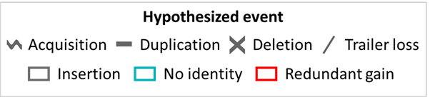

constrain
=========

Introduction
------------

.. _constrain-before-you-run:

Before you run
--------------

.. _constrain-basic:

Basic Usage
-----------

Output files
------------

.. _constrain-treeplot:

Tree plot
^^^^^^^^^

.. _constrain-tree-key:

Constrain event key
^^^^^^^^^^^^^^^^^^^

Events that Constrain can hypothesize are shown in the below key. They are the same as those for the :ref:`tree-key`

