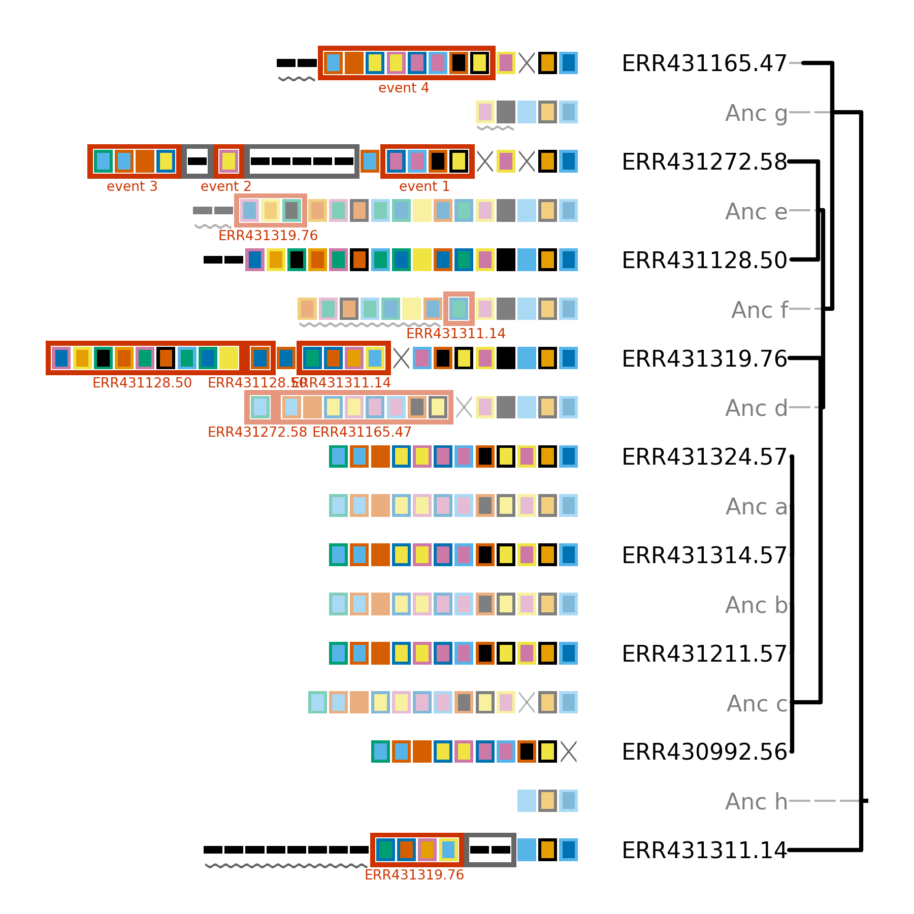

#########
constrain
#########

************
Introduction
************

``cctk constrain`` can be used to assess how CRISPR arrays may have evolved given a certain tree topology (i.e., how would CRISPR arrays have changed if their evolution were "constrained" by a certain topology).

This analysis can be useful when ``cctk crisprtree`` produces a topology that differs from that produced using other genomic data. In such a case, ``cctk constrain`` can provide information about whether a tree is still a reasonable explanation of CRISPR array relationships, but simply a less parsimonious topology than that inferred by ``cctk crisprtree``.

``cctk constrain`` can also indicate that horizontal gene transfer may have occurred. ``cctk constrain`` can hypothesize when a topology would require that arrays at different points in the tree independently acquire the same spacers (either by insertion or by leader-end acquisition). Such an event is highlighted in the produced plot and information concerning the event is sent to the ``stderr``.

**N.B** The tree provided to ``cctk constrain`` must be fully resolved (i.e., no polytomies). ``cctk constrain`` calculates ancestral arrays by comparing an array to its first sibling. In a polytomy, each array has multiple siblings. In such a case, ``cctk constrain`` will only compare the first two arrays when inferring the ancestral array. Thus, ``cctk constrain`` will run and produce normal outputs if given an incompletely resolved tree, but will not necessarily have correctly inferred ancestral states and so the ouput should be interpreted with care.

.. _constrain-before-you-run:

Before you run
==============

In addition to files produced by other CCTK tools such as ``cctk minced`` or ``cctk blast``, you will also need a tree of the relationships between your isolates. Information about which leaf labels in the tree you wish to analyze correspond to which arrays must also be provided. An example dataset and workflow are shown in the `tutorial <tutorial.html>`_.

.. _constrain-basic:

***********
Basic Usage
***********

The basic command to run ``cctk constrain`` requires three input files and the path to an output file:

.. code-block:: shell

	cctk constrain -a <Array_IDs.txt> -t <newick format tree file> -g <array-leaf file> -o <output tree plot>

Further description of the required arguments:

``-a`` File describing the spacers in each array being analyzed e.g. :ref:`array-ids` produced by ``cctk minced`` and ``cctk blast``.

``-t`` Tree in newick format. Tree will be treated as rooted unless ``-u`` is used (see)

``-g`` File corresponding leaf IDs in tree file to array IDs in file provided with ``-a``. Tab-delimited, 1 line per array-leaf ID pair. e.g., (Note array 1 present associated with two leaves on different lines)

.. code-block:: shell
	
	array1	leaf1
	array1	leaf2
	array2	leaf3
	...

************
Output files
************

.. _constrain-treeplot:

Tree plot
=========

The tree plot produced by ``cctk constrain`` is much like that produced by ``cctk crisprtree`` (see :ref:`tree-plot`). However, there are some differences which will be discussed below using this example image (generated using the dataset provided in the `tutorial <tutorial.html>`_).

There are two differences between the plot produced by ``cctk constrain`` and ``cctk crisprtree``.

1. The leaf labels here are a fusion of the leaf label in the input tree and the array ID associated with that leaf. The leaf label format in the above tree is leaf_label.array_id. e.g., leaf label ERR431165.47 in the above image indicates that leaf corresponds to the leaf ERR431165 in the input tree and that array 14 is depicted.

2. Branch lengths in the ``cctk constrain`` plot are not equal to the parsimony cost of predicted events if run using default settings (as is the case for ``cctk crisprtree``). Instead, the branch lengths of the input tree are retained. This behaviour can be changed using the ``--replace-brlens`` option.

.. _constrain-tree-key:

Constrain event key
===================

Events that Constrain can hypothesize are shown in the below key. They are the same as those for the :ref:`tree-key`

.. image:: images/tree_key.png

stdout
======

Newick format tree strings and ascii representation of the tree are written to the stdout.

stderr
======

If redundant acquisition events were found involving more than 2 arrays, the Event number and corresponding arrays will be written to stderr.

.. _constrain-advanced:

**************
Advanced Usage
**************

Plotting ascii representation of tree
=====================================

Tree topologies can be assessed quickly in the terminal using the ``--print-tree`` flag. For example, the tree shown in the :ref:`tree-plot` section is represented as shown below:

.. code-block:: shell

	                                                               /ERR430992.56
	                                                 /-------------Anc c
	                                                 |             |ERR431211.57
	                                                 |             Anc b
	                                               /-Anc d         |ERR431314.57
	                                               | |             Anc a
	                                               | |             \ERR431324.57
	                                           /---Anc f
	                                           |   | \-------------- ERR431319.76
	                                           |   |
	/------------------------------------------Anc g  /------------ ERR431128.50
	|                                          |   \--Anc e
	|                                          |      \-------------- ERR431272.58
	Anc h                                      |
	|                                          \------------- ERR431165.47
	|
	\------- ERR431311.14

Saving hypothetical ancestral arrays
====================================

``cctk crisprtree`` produces hypothetical ancestral arrays that that contain a subset of the spacers present in the input arrays. These arrays can be saved to an output file using ``--output-arrays <filename>``.

Controlling plot colours
========================

Controlling random assignment of colours
----------------------------------------

When using a built-in or user-provided colour scheme, and when assigning random colour combinations to large numbers of spacers, the ``random`` module for python is used. You can exert some control over the assignment of colours by setting the ``--seed`` that controls random processes. And example of when this is useful is if you do not need specific spacers to have specific colours, but would like to shuffle colours around to avoid similar colours being close together.

Providing your own colour scheme
--------------------------------

``cctk`` uses a single built-in colour scheme, described by `Wong, 2011 <https://www.nature.com/articles/nmeth.1618>`_ that is colour blind-friendly and has high visual contrast between colours. However, you can use custom colours as well using ``--colour-file``.

Consistent colour schemes between ``cctk`` tools
------------------------------------------------

The ``cctk`` tools ``crisprdiff``, ``crisprtree``, and ``constrain`` have the option to save and load spacer colour assignments to allow consistent colour schemes between different visual representations of the same arrays. This feature can be used for any plots containing at least 1 of the same spacers, even if the set of spacers in each plot is not entirely the same (**N.B** When colours are set this way, any colour combinations assigned to a spacer that is not present in the analysis are still reserved and will not be used for other spacers.)

To save the colour scheme used in a plot by any of these tools, use ``--colour-scheme-outfile`` and provide the path (and filename) to which the file should be written. A saved colour scheme file can then be provided for use in future plots using ``--colour-scheme-infile``.

Controlling plot elements and size
==================================

Plot element control
--------------------

Several visual elements of the plot produced by ``cctk constrain`` can be controlled using command line options. An illustration of the effect of these options is shown in the image below.

The default behaviour of ``cctk constrain`` is to de-emphasize ancestral arrays by applying transparency to their node labels and array cartoons. This can be disabled using the ``--no-fade-anc`` option.

The default behaviour of ``cctk constrain`` is to annotate hypothetical events onto arrays. This can be disabled using the ``--no-emphasize-diffs`` option.

The inclusion of branch length annotations can be controlled using ``-b``. Branch lengths correspond to the weighted parsimony cost of events between an array and its ancestor. Branch length labels are added at the midpoint of the corresponding branch.

Branch lengths can be scaled by a (floating point number) factor provided using ``--brlen-scale``. This can be used to increase or decrease all branch lengths. Horizontal space taken up by branches in the tree reduces the space available for CRISPR array cartoons so this option can be used to control the amount of space in the plot used by those two components.

The default behaviour of ``cctk constrain`` is to align node labels and array cartoons. Label alignment can be deactivated using ``--no-align-labels``. The alignment of both cartoons and labels can be deactivated using ``--no-align-cartoons``. Note that it is not possible to deactivate the alignment of array cartoons without also deactivating the alignment of labels.

Plot size and resolution
------------------------

The size and resolution of plots produced by ``cctk constrain`` can be controlled using command line options. These options can be used to generate images of the exact specification required for a figure, or may be necessary to create a sensibly scaled image (see :ref:`tree-limitations`).

Plot height and width can be set using the options ``--plot-width`` and ``--plot-height`` and providing the desired size in inches.

pixel density (DPI) can be set using ``--dpi``. The images on this page were generated at 600 DPI. **N.B.** DPI settings are only relevant for images generated by ``cctk constrain`` in raster formats such as PNG. SVG outputs are unaffected by DPI settings.

``--font-override-labels`` and ``--font-override-annotations`` can be used to control the size of text in the plot (default value is 10pt).
