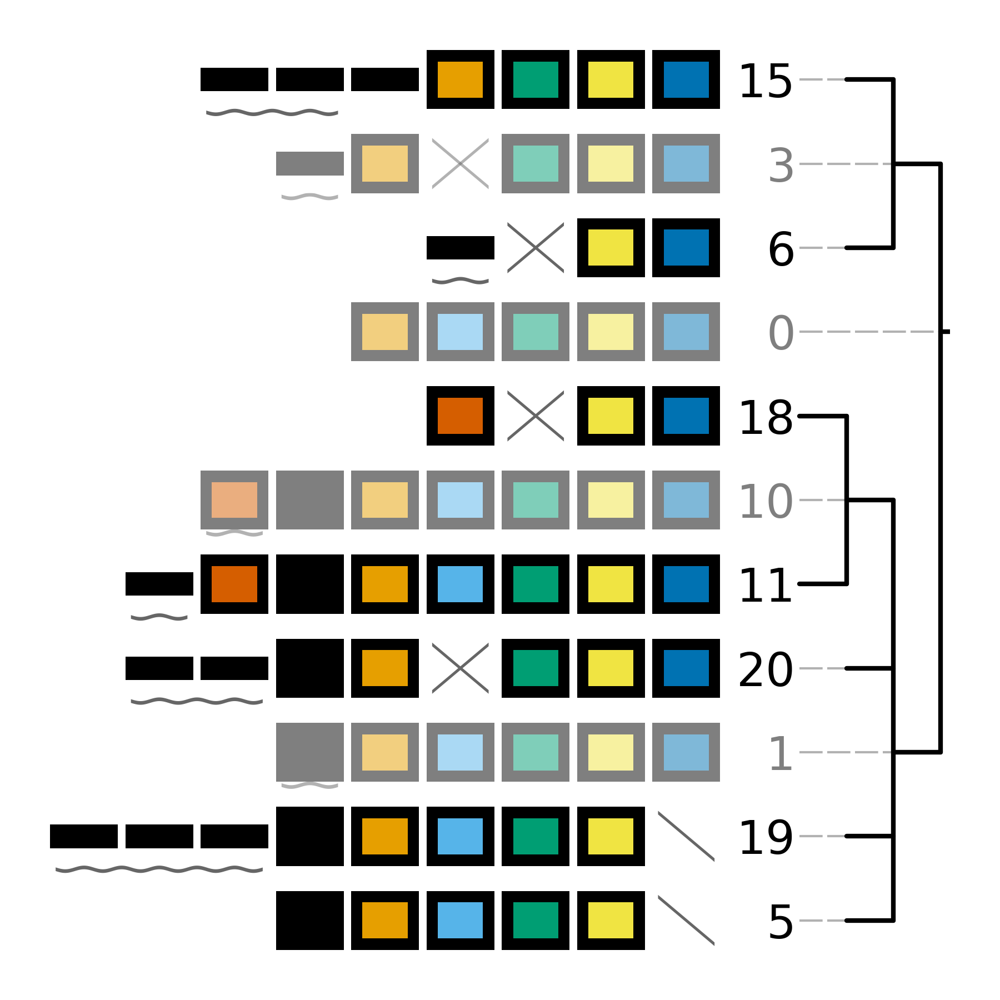

######
evolve
######

************
Introduction
************

``cctk evolve`` is a tool designed to perform *in-silico* evolution of CRISPR arrays. It was developed to provide test datasets to evaluate the performance of ``cctk crisprtree`` and is packaged as part of CCTK to allow the generation of test or example datasets for use with CCTK tools.

How does it work
================

``cctk evolve`` performs *in silico* evolution of CRISPR arrays according to the following process in which spacers and arrays are represented simply by integers:

#. An initial array of length set using ``-i`` is created with spacers numbered 1 through whatever number is set (default: 5). This array is assigned the number 0.

#. Based on the relative frequencies of acquisition, deletion, and trailer loss set uing ``-a``, ``-d``, and ``-t``, respectively, an event is chosen at random (defaults are 75, 10, and 15, respectively).

#. The chosen event is applied to 

.. _evolve-basic:

***********
Basic Usage
***********

``cctk evolve`` requires a single input: the number of events (``-n``) for which the evolution should be allowed to continue. e.g.:

.. code-block:: shell

	cctk evolve -n 20

In addition, reproducable simulations can be performed by using the seed option ``-s``. All examples described on this page are run with the following command using a seed value of 1

.. code-block:: shell

	cctk evolve -n 20 -s 1

************
Output files
************

All ``cctk evolve`` output files are named according to a fixed convention and can not be set by the user at run time. File names are composed of the data type followed by the settings used in that run. 

For example, for the file "evolved_arrays_5_20_75_10_15_50_1.txt" the parts of the filename are as follows.

"evolved_arrays" - indicates that this file contains the arrays generated during the *in silico* evolution process. This file is equivalent to the :ref:`array-ids` file used by other CCTK tools.

"5_20_75_10_15_50_1" - these numbers correspond to the following settings respectively:
	
* ``-i`` initial array length
* ``-n`` number of events
* ``-a`` acquisition rate
* ``-d`` deletion rate
* ``-t`` trailer-loss rate
* ``-l`` array-loss rate
* ``-s`` seed used for random processes

.. _evolve-treeplot:

Tree plot
=========

The tree plot produced by ``cctk evolve`` is much like that produced by ``cctk crisprtree`` and ``cctk constrain``. (See  :ref:`tree-plot`.) However, as shown in the below image, the plots are not identical.

In the above image, ancestral arrays are slightly transparent just like in other CCTK tree plots. However, instead of being assigned IDs such as "Anc a", ancestral arrays in tree plots produced by ``cctk evolve`` are assigned numbers.

The reason for this difference is that ancestral arrays in tree plots produced by ``cctk evolve`` are not inferred based on extant arrays. Instead these arrays are the true ancestral arrays of their descendents in the tree. 

.. _evolve-arrayfile:

Evolved arrays
==============

.. _evolve-colourfile:

color_scheme
============

.. _evolve-treefile:

Tree file
=========

.. _evolve-advanced:

**************
Advanced Usage
**************
