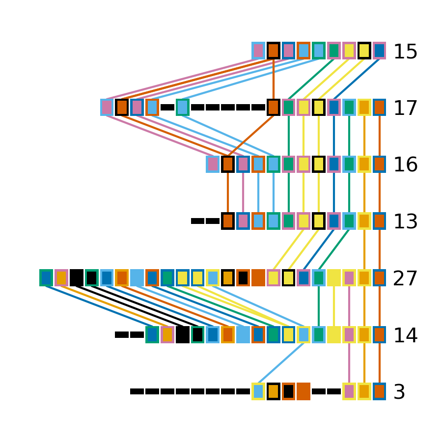
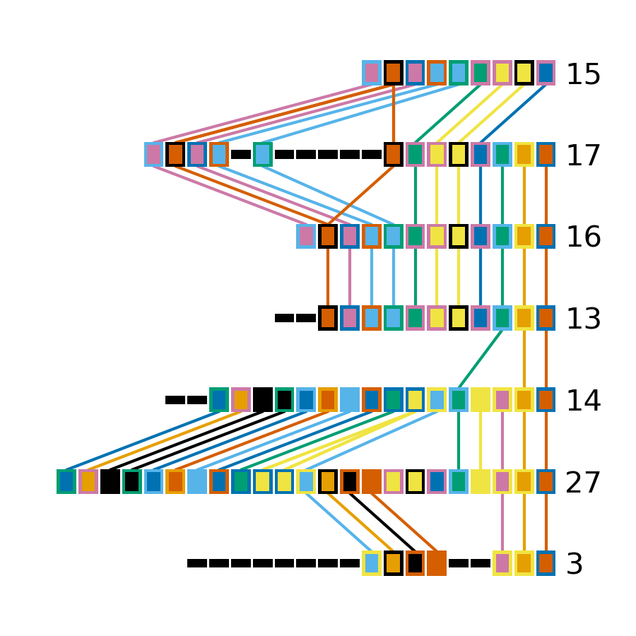
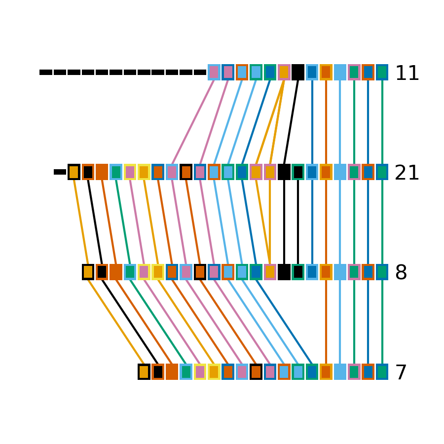
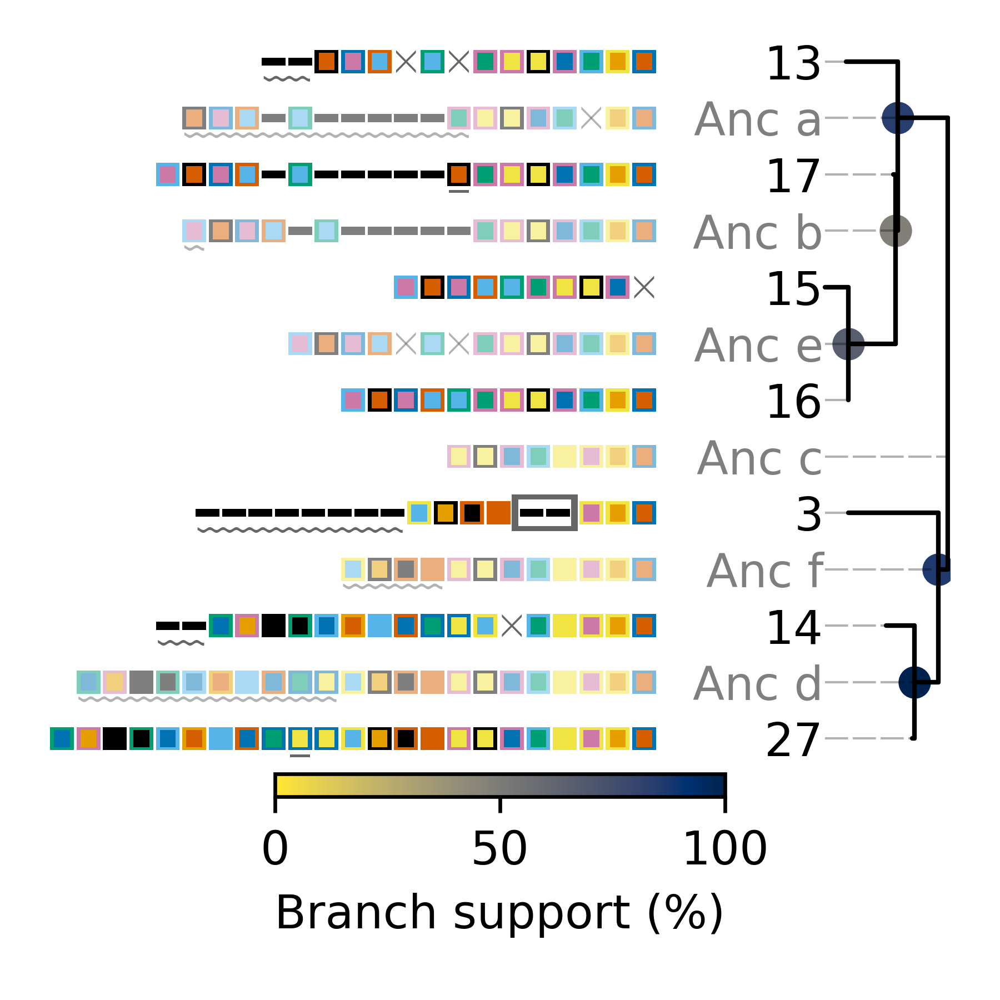
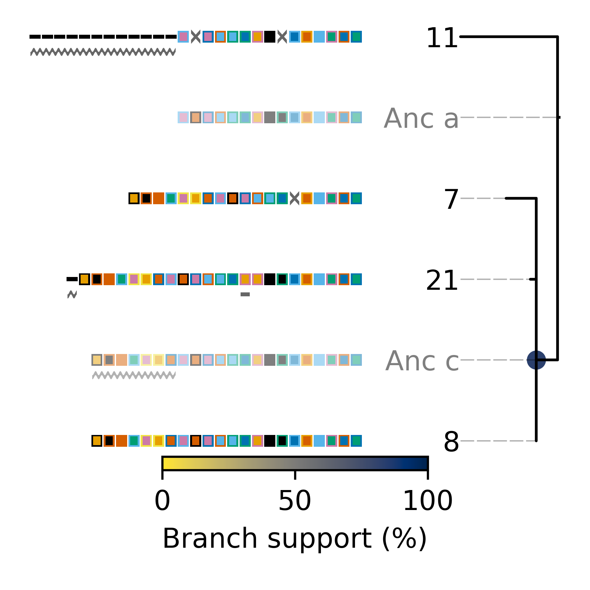
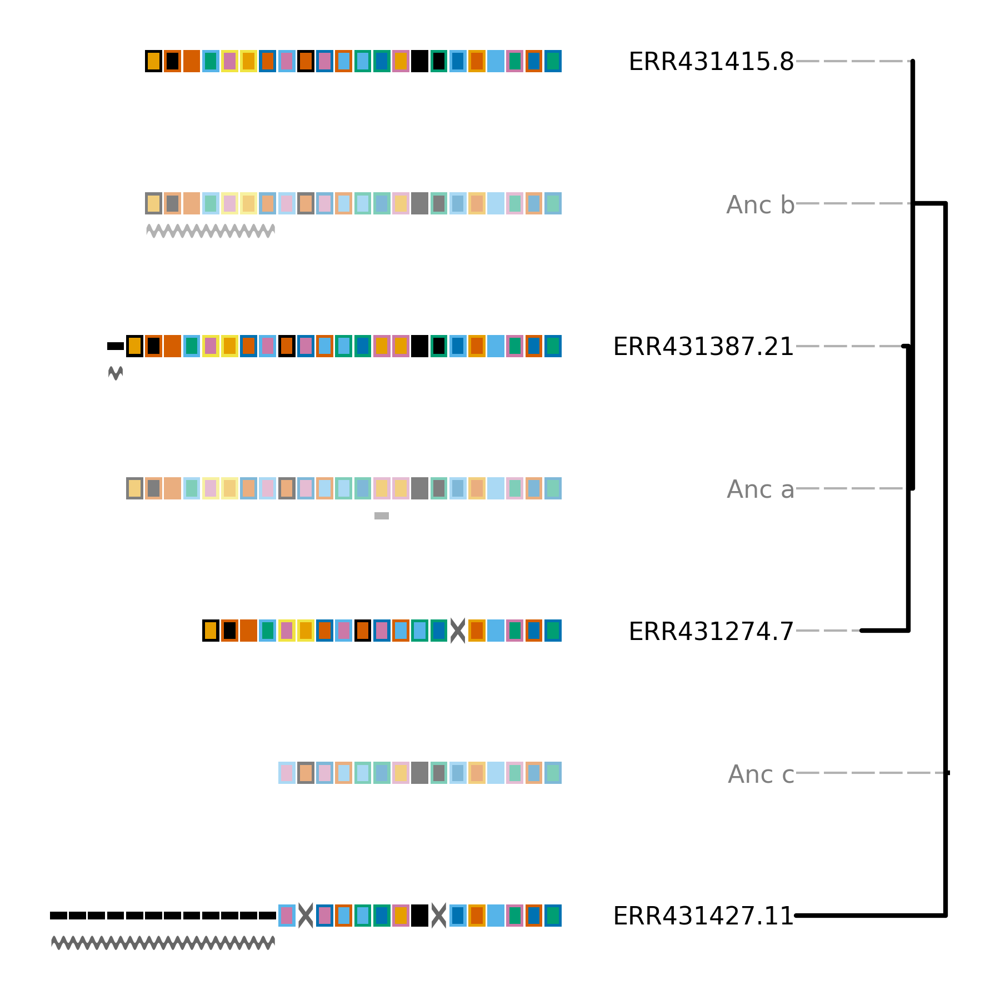
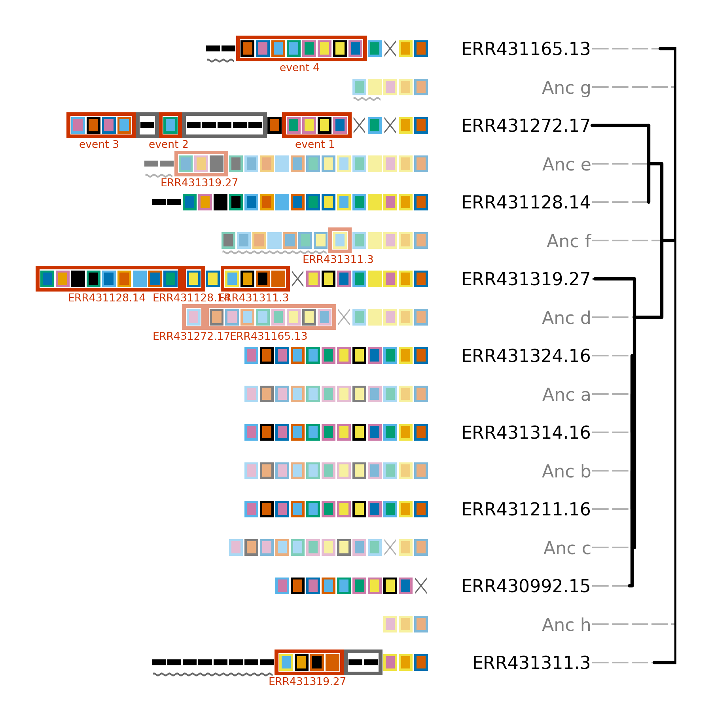

########
Tutorial
########

***************
Before we begin
***************

This tutorial is intended to illustrate how one may use CCTK to perform an analysis of the CRISPR arrays present in a set of assemblies. This is done as two separate tutorial sections. The first is longer and includes a lot of discussion about the different CCTK command options that can be used as well as discussion of data interpretation. In addition, an abridged tutorial is included to simply illustrate an example of the commands that might be used with minimal discussion. The content in both tutorials will be the same.

Throughout this tutorial, example commands are provided as well as the output produced by those commands. Commands are indicated by the presence of a $ symbol at the beginning of the line (representing the command prompt). Lines that do not begin with a $ symbol are part of the ouput produced by the previous command.

In addition, some lines begin with # symbols. These are comments that are intended to clarify the purpose of surrounding code.

Data retrieval
==============

For this tutorial we will work through and analyze part of the dataset used in the CCTK publication, which is itself a subset of the data presented by `Marvig et al., 2012 <https://doi.org/10.1038/ng.3148>`_. The example data used here are hosted on the `CCTK github page <https://github.com/Alan-Collins/CRISPR_comparison_toolkit>`_ and can be downloaded and extracted as follows:

.. code-block:: shell

	$ wget https://github.com/Alan-Collins/CRISPR_comparison_toolkit/raw/main/Example_data/Example_data.tar.gz -O - | tar -xz

This should download and extract a directory containing 14 *Pseudomonas aeruginosa* assemblies and some other files we will use later. Each assembly filename corresponds to the `ENA <https://www.ebi.ac.uk/ena/browser/home>`_ sequence accession for the corresponding sequencing run. These assemblies were produced using `SPAdes <https://github.com/ablab/spades>`_ with default settings.

.. code-block:: shell

	$ ls -1 Example_Assemblies
	ERR430992.fasta
	ERR431128.fasta
	ERR431165.fasta
	ERR431211.fasta
	ERR431227.fasta
	ERR431272.fasta
	ERR431274.fasta
	ERR431311.fasta
	ERR431314.fasta
	ERR431319.fasta
	ERR431324.fasta
	ERR431387.fasta
	ERR431415.fasta
	ERR431427.fasta

Installing CCTK
===============

If you haven't already, `install <usage.html>`_ CCTK into a ``conda`` environment

.. code-block:: shell
	
	# also requires bioconda and conda-forge channels
	$ conda create -n cctk -c alan-collins cctk
	$ conda activate cctk

For this example, we will use both of the CRISPR identification tools included in CCTK to illustrate how they both work with the same input data. However, for simplicity, output from ``cctk minced`` will be used in subsequent analysis sections.

*************************
Analyzing example dataset
*************************

Identifying CRISPR arrays using ``cctk minced``
===============================================

``cctk minced`` is the easier to use of the two CRISPR identification tools included in CCTK and is a good choice to start with. 

First, an important note: For many of the downstream analyses in CCTK, CRISPR array orientation is very important. It is therefore crucial that you know the sequence of CRISPR repeats in your assemblies in the correct orientation (i.e., leader end 5' of the repeat, trailer end 3'). If you do not yet know the correct orientation of your repeats, you can proceed with these analyses as ``cctk minced`` can identify CRISPR arrays with unknown repeats and will consistently orient them using a built-in database of repeats. However, you will want to come back and correctly orient your arrays before using the tools ``CRISPRtree`` or ``constrain``.

Setting up and running MinCED
-----------------------------

``cctk minced`` uses `MinCED <https://github.com/ctSkennerton/minced>`_ to identify CRISPR arrays and then processes the output files produced by MinCED. ``cctk minced`` runs MinCED on all of the files in the input directory. In our case the directory is "Example_assemblies/". Before we run it, we'll make an directory to contain the output of ``cctk minced``, then we can run it. While `cctk minced` includes the three *P. aeruginosa* CRISPR types in its built-in database of repeats, we will provide them here to illustrate that step. They were included in the data you downloaded above: example_repeats.fna.

First let's just make a directory for the output and run the MinCED step. We could run everything in one step using ``-m -p``, but we will split it up here to go through the process in more detail.

.. code-block:: shell
	
	# Make output dir
	$ mkdir Minced_CRISPRs/

	# Run cctk minced
	$ cctk minced -i Example_Assemblies/ -o Minced_CRISPRs/ -m

Exploring MinCED output before processing using ``cctk minced``
---------------------------------------------------------------

After a few seconds, you will see that a new directory has been created in the Minced_CRISPRs/ directory.

.. code-block:: shell

	$ ls Minced_CRISPRs/
	MINCED_OUT

This new directory contains all of the output files produced by MinCED. Each of these files is named using the base filename (i.e., excluding extension) of the input files, with "_minced_out.txt" added.

.. code-block:: shell

	$ ls -1 Minced_CRISPRs/MINCED_OUT/
	ERR430992_minced_out.txt
	ERR431128_minced_out.txt
	ERR431165_minced_out.txt
	ERR431211_minced_out.txt
	ERR431227_minced_out.txt
	ERR431272_minced_out.txt
	ERR431274_minced_out.txt
	ERR431311_minced_out.txt
	ERR431314_minced_out.txt
	ERR431319_minced_out.txt
	ERR431324_minced_out.txt
	ERR431387_minced_out.txt
	ERR431415_minced_out.txt
	ERR431427_minced_out.txt

These output files are the unaltered output produced by MinCED and are where ``cctk minced`` gets all the information it uses (except reference repeat sequences provided by the user). 

If you are working with assemblies with unknown repeats, you can easily extract a list of the repeats found by MinCED and count the number of times each repeat sequence occurs by pulling out nucleotide sequence from the repeat column in the MinCED output files. For the assemblies analyzed here, the following repeats were found:

.. code-block:: shell

	$ cut -f3 Minced_CRISPRs/MINCED_OUT/* | grep -Po "[ATCG]{15,100}" | sort | uniq -c | sort -k1 -nr | head
    185 GTTCACTGCCGTATAGGCAGCTAAGAAA
    168 TTTCTTAGCTGCCTATACGGCAGTGAAC
    156 TTTCTTAGCTGCCTACACGGCAGTGAAC
     50 GTTCACTGCCGTGTAGGCAGCTAAGAAA
     27 GTCGCGCCCCGCACGGGCGCGTGGATTGAAAC
      7 TTTCACTGCCACATAGGTCGTCAAGAAA
      5 TTTCTTAGCTGCCTGTACGGCAGTGAAC
      5 GTTCACTGCCGTACAGGCAGCTAAGAAA
      3 TTTCTTGACGACCTATGTGGCAGTGAAA
      3 TTTCTTAACTGCCTATACGGCAGTGAAC

In the output returned by this command, the second column is the nucleotide sequence of each repeat found by MinCED, while the first column is the number of instances of that repeat that were found. Note that the first 2 lines are highly similar sequences that are in different orientations to one another. In fact the first 4 lines are minor variations on the same sequence. This highlights a weakness of MinCED that it is important to be aware of: it does not check the orientation of repeats so there is a roughly 50% chance that the repeat will be correctly oriented in any given sequence. 

``cctk minced`` attempts to consistently orient CRISPR arrays by comparing each query repeat to a built-in database of repeat sequences, or a user-provided database of repeats (reverse complement is also checked). If the query repeat matches best in the reverse complement then the entire corresponding array is reversed. Even if the specific repeat present in your assemblies is not in the built-in database, there is a good chance that all instances of that repeat (even with some SNPs) will match the same reference repeat, resulting in consistent (even if incorrect) orientation even for unknown repeats. We will discuss below what happens when repeats don't match well with any of the reference repeats used by ``cctk minced``

Processing MinCED output files
------------------------------

Now that we have briefly explored the output produced by MinCED, we will use ``cctk minced`` to process those output files. As we have already run MinCED, we don't need ``-m`` or to point ``cctk minced`` to our assemblies with ``-i``.

.. code-block:: shell
	
	$ cctk minced -o Minced_CRISPRs/ -p
	Total unique spacers: 334
	Total unique arrays: 27

``cctk minced`` outputs a summary of the number of unique spacers and CRISPR arrays identified to stderr. Output files produced here are described in the ``cctk minced`` :ref:`minced-output` section.

As we did not provide a file containing FASTA format CRISPR repeats, ``cctk minced`` uses the built-in database of CRISPR repeats (currently subtypes I-A, I-C, I-E, and I-F). The built-in database is fine for the assemblies used here as *P. aeruginosa* encodes CRISPR subtypes I-C, I-E, and I-F.

Note that each spacer has its predicted CRISPR subtype included in its FASTA header and this header is used as an identifier for each spacer in all other output files.

.. code-block:: shell

	$ head -4 Minced_CRISPRs/PROCESSED/CRISPR_spacers.fna
	>1F_1
	AGGTCGAAACGAAGGTGCTGATGGGTCGCCTT
	>1F_2
	AATAATAATACTCAGCCCTAGCGCCCTGAGCA

Specifying expected repeat sequences
------------------------------------

Now let's process the MinCED output using the example_repeats.fna file that we downloaded earlier. This file contains sequences for the three CRISPR subtypes found in *P. aeruginosa*, but the FASTA headers for those sequences differ from the IDs used in the built-in CRISPR database (e.g. "1F" above vs "I-F" in the example file):

.. code-block:: shell

	$ cat example_repeats.fna
	>I-C
	GTCGCGCCCCGCACGGGCGCGTGGATTGAAAC
	>I-E
	GTGTTCCCCACGGGTGTGGGGATGAACCG
	>I-F
	GTTCACTGCCGTGTAGGCAGCTAAGAAA

We run the processing steps again with these repeat sequences by providing them using ``-r``. Notice that providing repeat sequences does not change the number of spacers or arrays found. This is only used to decide which direction each array should be and to assign names to spacers.

.. code-block:: shell
	
	# Note running with a custom repeat file doesn't change the number of spacers and arrays identified
	$ cctk minced -o Minced_CRISPRs/ -p -r example_repeats.fna
	Total unique spacers: 334
	Total unique arrays: 27

Rerunning processing steps will overwrite the existing files in the Minced_CRISPRs/PROCESSED/ directory. If you ever want to preserve the output from a processing run, you will need to rename the PROCESSED folder to something else to prevent the data being overwritten.

When repeats are provided as an input file, the built-in database of CRISPR repeats is not used. All identified CRISPR spacers will therefore be assigned subtypes with the IDs present in the provided file.

.. code-block:: shell

	$ head -4 Minced_CRISPRs/PROCESSED/CRISPR_spacers.fna
	>I-F_1
	AGGTCGAAACGAAGGTGCTGATGGGTCGCCTT
	>I-F_2
	AATAATAATACTCAGCCCTAGCGCCCTGAGCA

What about if the repeats in the built-in database or in the file provided using ``-r`` are not the repeats present in our assemblies? Let's see.

The example assemblies we are working with here have only subtype I-F arrays. Let's see what happens if we use a repeats file containing only the I-E repeat:

.. code-block:: shell
	
	# Use grep to find the line containing "I-E" and return that line and the line after
	$ grep -A1 "I-E" example_repeats.fna > 1E_repeat.fna
	$ cat 1E_repeat.fna
	>I-E
	GTGTTCCCCACGGGTGTGGGGATGAACCG
	
	# Now use the new 1E_repeat.fna file as input to cctk minced with -r
	$ cctk minced -o Minced_CRISPRs/ -p -r 1E_repeat.fna
	Total unique spacers: 334
	Total unique arrays: 27

Now if we have a look at our CRISPR spacers we will see that the first couple of spacers in our file, which were previously identified as subtype I-F, have a different header

.. code-block:: shell

	$ head -4 Minced_CRISPRs/PROCESSED/CRISPR_spacers.fna
	>unknown_CRISPR_type(I-E)_1
	GACCGGCAGCAAGCCAAGGTGCAGTCGCTGCA
	>unknown_CRISPR_type(I-E)_2
	AGATCGTCCTGGGCGGCAGGTCCGGATTGTCT

When ``cctk minced`` finds that a repeat differs at more than 5 bases from any repeat in the database being used, that repeat is classified as unknown. When a repeat is classified as unknown, the most similar repeat subtype is included in parentheses in the ID for all spacers in the arrays with that repeat. As we only provided a repeat associated with subtype I-E, that repeat is the best matching and is therefore included in the header for all spacers.

**N.B.** Even if the best-matching repeat in the database used (built-in or from the file provided) differs by more than 5 mismatches, that repeat is still used to orient the array. This is done so that even though the resulting orientation may not be correct relative to the leader end, at least all the arrays with the same repeat will be oriented the same way. This is important as CCTK checks for identical spacers between arrays based on simply comparing their sequence (meaning two identical spacers that are the reverse complement of one another will not be identified as identical). In addition, consistently oritenting the arrays will allow you to visualize them later and hopefully easily spot whether they are the right way round or not.

Grouping very similar spacers based on SNPs
-------------------------------------------

Sometimes, due to the acquisiton of mutations, or sequencing errors, CRISPR spacers may be identified that differ only by one or two bases. If you wish spacers that differ by a small amount to be considered the same by ``cctk`` tools, then you can use ``cctk minced`` to identify groups of highly similar spacers and to assign them the same ID. This is done by using ``-s`` and providing an integer threshold defining the number of SNPs that can exist between to spacers for those spacers to be considered the same. The deafault behaviour of ``cctk minced`` is to consider spacers that differ by a single base to be different.

This process is performed during the processing steps performed by ``cctk minced`` and so we do not need to run MinCED again. Our command is therefore very similar to those above:

.. code-block:: shell

	# Consider spacers with 2 or fewer SNPs to be the same
	$ cctk minced -o Minced_CRISPRs/ -p -s 2
	Total unique spacers: 327
	Total unique arrays: 27

Note that the number of unique spacers identified is now 327 instead of 334. 

The spacers that have now been reduced to a single representetive are described in an output file that was not produced by previous runs: :ref:`spacer-cluster-reps`

.. code-block:: shell

	$ cat Minced_CRISPRs/PROCESSED/Spacer_cluster_members.txt
	1F_15   TGGAGAAAAGCAATTCGAGTGGTGCGAGGCCA
	1F_19   TGCCCGAATACGACTTGCGCGAGGAAGACGGT
	1F_36   AGCAGCGGCTCCAGAAAGAGGGGCGCTGCCTG
	1F_45   TGTCCCGAAGTTCATAAGCGGGCTTAGGGCGA TGTCTCGAAGTTCATAAGCGGGCTTCGGGCGA TGTCCCGAAGTTCATAAGCGGGCTTCGGGCGA
	1F_85   GCCCAGGCACGTTTGCTCGCGCTTTGATCTCA

.. _blast-tutorial:

Identifying CRISPR arrays using ``cctk blast``
==============================================

Setting up
----------

Before we can run ``cctk blast`` we must first perform a few steps to prepare our sequences. ``cctk blast`` requires that we provide out input in the form of a blast database. 

As described in the ``cctk blast`` :ref:`blast-before-you-run` section, there are several requirements that your sequences must satisfy:

#. No pipe symbols ("|") in any of your fasta headers.
#. None of the fasta headers in the sequences are the same.
#. If your sequences are broken up into multiple contigs, ensure that each fasta header contains an identifier that can be used to associate the sequences.

The example sequences we are working with here were assembled using Spades, which produces assemblies with contig headers that can not be distinguished between files:

.. code-block:: shell

	$ head -1 Example_Assemblies/* | head -5
	==> Example_Assemblies/ERR430992.fasta <==
	>NODE_1_length_922990_cov_42.400140

	==> Example_Assemblies/ERR431128.fasta <==
	>NODE_1_length_703400_cov_61.868510

If we were to combine these sequences into a single blast database, it would be laborious to later figure out which sequences came from which files. Instead, as each filename contains identifying information (the ERR accession number), we will add that accession to each fasta header in each file. This modification can be acheived with the following bash commands:

.. code-block:: shell
	
	$ for file in Example_Assemblies/*; do id=${file%.*}; id=${id#*/}; sed -i "s/>/>${id}_/" $file; done

	# All fasta headers now contain the ERR accession number
	$ head -1 Example_Assemblies/* | head -5
	==> Example_Assemblies/ERR430992.fasta <==
	>ERR430992_NODE_1_length_922990_cov_42.400140

	==> Example_Assemblies/ERR431128.fasta <==
	>ERR431128_NODE_1_length_703400_cov_61.868510

Now all of the fasta headers in our assembly files can easily be related back to the assembly to which they belong.

Now let's make a directory to contain our blastdb, combine our sequences, and make the bastabase:

.. code-block:: shell

	$ mkdir Blastdb
	$ cat Example_Assemblies/* > all_assemblies.fna
	$ makeblastdb -in all_assemblies.fna -out Blastdb/assembly_db -dbtype nucl -parse_seqids

We are now ready to identify CRISPR arrays using ``cctk blast``.

Running ``cctk blast``
----------------------

First, make a folder to contain the outputs produced by ``cctk blast``. Then we can run it. We need to provide a description of an identifier that is present in all the fasta headers for a given assembly as our assemblies are all in multiple contigs. In our case that identifier is the ERR accession we added above. We will provide it as a regex here, but see the :ref:`blast-contig-ids` section of the `cctk blast <blast.html>`_ documentation page for a description of other options for how you can specify this information.

.. code-block:: shell
	
	# Make output dir
	$ mkdir Blast_CRISPRs

	# Run cctk blast
	$ cctk blast -d Blastdb/assembly_db -r example_repeats.fna -o Blast_CRISPRs/ -p "ERR\d+" -s 2
	Total unique spacers: 242
	Total unique arrays: 22

Note that ``cctk blast`` identifies a different number of spacers and a different number of arrays than ``cctk minced`` did. (326 vs 327 and 28 vs 27 when run without using ``-s``). This difference reflects the different behaviours of MinCED and BLAST and their tolerance of differences in the repeat sequences in these arrays.

``cctk blast`` can also use a SNP threshold to consider slightly different spacers to be the same, just like with ``cctk minced``. In addition, as most of the running time of ``cctk minced`` is spent running ``blastn`` using a BLASTdb followed by lots of ``blastdbcmd``, we can improve running time by using multiple threads for those two steps with ``-t``

.. code-block:: shell
	
	# Won't work if you are on a computer with only 1 thread
	# We're including the time command to get running time information

	# 1 thread as we did above
	$ time cctk blast -d Blastdb/assembly_db -r example_repeats.fna -o Blast_CRISPRs/ -p "ERR\d+" -s 2 -t 1
	Total unique spacers: 326
	Total unique arrays: 28

	real    0m23.217s
	user    0m3.917s
	sys     0m1.190s

	# 2 threads
	$ time cctk blast -d Blastdb/assembly_db -r example_repeats.fna -o Blast_CRISPRs/ -p "ERR\d+" -s 2 -t 2
	Total unique spacers: 326
	Total unique arrays: 28

	real    0m15.294s
	user    0m3.720s
	sys     0m1.232s

	# 4 threads
	$ time cctk blast -d Blastdb/assembly_db -r example_repeats.fna -o Blast_CRISPRs/ -p "ERR\d+" -s 2 -t 4
	Total unique spacers: 326
	Total unique arrays: 28

	real    0m9.694s
	user    0m3.395s
	sys     0m1.261s

As you can see in the example above showing run times on my computer ("real" is the actual running time), increasing the number of threads used can improve runtimes and is especially helpful if you are running ``cctk blast`` on a large number of assemblies

``cctk blast`` produces the same kind of outputs as ``cctk minced``. We can see the list of output files produced by each tool as a sort of table, with the ``cctk minced`` output in the left column and ``cctk blast`` output in the right column. The following command lists the contents of each output directory in separate columns with the name of the ``cctk`` tool that produced them as column headers:

.. code-block:: shell

	$ paste <(echo "Minced"; ls Minced_CRISPRs/PROCESSED/) <(echo "Blast"; ls Blast_CRISPRs/) | column -t
	Minced                      Blast
	Array_IDs.txt               Array_IDs.txt
	Array_locations.bed         Array_locations.bed
	Array_network.txt           Array_network.txt
	Array_representatives.txt   Array_representatives.txt
	Array_seqs.txt              Array_seqs.txt
	CRISPR_spacers.fna          CRISPR_spacers.fna
	CRISPR_summary_table.csv    CRISPR_summary_table.csv
	CRISPR_summary_table.txt    CRISPR_summary_table.txt
	Spacer_cluster_members.txt  Spacer_cluster_members.txt

.. _network-tutorial:

Exploring CRISPR array relationships using a network representation
===================================================================

Now that we have predicted CRISPR arrays in the example assemblies, we can begin to explore the relationships between these arrays. We will first visualize array relationships as a network to see how arrays in this dataset are related on a broad scale, and then we will explore more closely the relationships between a small number of arrays. In the following example, we will use `Cytoscape <https://cytoscape.org/>`_ to visualize our array relationship network and will work with the data we generated using ``cctk minced``. We will refer to arrays within the network representation as "nodes" and the relationship between two arrays as an "edge".

Both ``cctk minced`` and ``cctk blast`` produced a file called :ref:`array-network` which can be read directly in to Cytoscape by simply clicking and dragging the file onto a Cytoscape window. You should then define the columns as in the following image (These definitions are used for applying styles according to node and edge attributes):

.. image:: images/network_import_tutorial.png

After importing the data, we can use styles to colour edges according to the number of spacers shared or the jaccard similarity between arrays to quickly get a sense of the relationships within each of our clusters. Below is an image showing the network with edges coloured according to the Jaccard similarity between each pair of nodes (darker colours indicate higher array similarity).

.. image:: images/eg_network_tutorial.png

In this network representation of array relationships, it is clear that there are five distinct clusters of arrays. Any arrays that do not share any spacers with any other arrays in the dataset are not shown in this network. We will now look more closely at the two largest clusters using other CCTK tools. Note that the largest cluster here is the same as "Cluster 2" which was analyzed in the CCTK publication. However, the array IDs do not correspond between this network and the dataset presented in the publication because we are only working with a subset of the dataset here.

.. _diffplot-tutorial:

Using CRISPRdiff to visualize array relationships
=================================================

Introduction
------------

`CRISPRdiff <crisprdiff.html>`_ can be used to quickly and easily identify the spacers that are shared and distinct between CRISPR arrays. Here we will use it to visualise the two largest clusters of arrays that we saw in the :ref:`network-tutorial`. For this example we will create a directory within our Minced_CRISPRs/ directory and save plots at that location.

**N.B.** In the following sections, the spacers within arrays will be referred to using their index within the array and their colour. e.g. the leader-most (i.e., left-most) spacer in a given array is spacer 1, while the next spacer (2nd spacer) is spacer 2. From the trailer end, spacers will be numbered using negative numbers. E.g. the trailer-most (i.e., right-most) spacer is spacer -1, while the next spacer from the trailer end is -2 etc.

.. code-block:: shell

	$ cd Minced_CRISPRs
	Minced_CRISPRs$ mkdir Plots

Largest cluster
---------------

First let's look at the largest cluster.

.. code-block:: shell

	Minced_CRISPRs$ cctk crisprdiff -a PROCESSED/Array_IDs.txt -o Plots/largest_cluster_diff.png 3 13 14 15 16 17 27
	Identified 28 spacers present in more than one array. 

That command produces the plot shown below. The components of this plot are described in the :ref:`diff-output` section of the `CRISPRdiff <crisprdiff.html>`_ documentation page.

The plot produced by CRISPRdiff shows spacers that are unique to each array (thin black rectangles) and present in more than one array (coloured rectangles - fill and outline colour combination is unique to each spacer). In addition, to further highlight spacers found in more than one array, lines are drawn between identical spacers in adjacently plotted arrays. The colour of these lines is the same as the fill colour of the corresponding spacer (you can also add an outline to the lines corresponding to the outline of the spacer using ``--connection-outline``).

Choosing array order
^^^^^^^^^^^^^^^^^^^^

The default behaviour of CRISPRdiff is to plot arrays in an order that maximizes the number of spacers shared between adjacently plotted arrays (seen as lines between arrays). However, depending on which regions of the arrays you are more interested in, you may wish to manually set the order to better highlight certain relationships. In the above image, the three spacers near the middle of array 3 are shared with another array (indicated by the presence of fill and outline colour rather than being thin black rectangles). However, no lines are drawn to indicate where in another array those spacers are also seen. If we were interested in displaying how these spacers in particular are shared between arrays then we may want to change the array order to acheive that. These three spacers can also be seen in the middle of array 27 (next to the same blue and yellow spacer they are adjacent to in array 3)

.. code-block:: shell

	# Array order is specified from top to bottom of the output plot
	Minced_CRISPRs$ cctk crisprdiff -a PROCESSED/Array_IDs.txt -o Plots/largest_cluster_diff_reorder.png --preordered 15 17 16 13 14 27 3
	Identified 28 spacers present in more than one array. 

This produces the below plot that better highlights the presence of the spacers in arrays 3 and 27. 

Investigating individual spacers
^^^^^^^^^^^^^^^^^^^^^^^^^^^^^^^^

The CRISPRdiff plot of the larger cluster arrays shows that the spacer at position 2 in array 17 has been duplicated. This spacer is present at both position 2 and near the middle of array 17 (position 12). This plot was generated using CRISPR spacers identified using ``cctk minced`` with the option ``-s 2``. This means that spacers differing by two or fewer mismatches have been considered the same. In the case of this spacer, we might want to check if this spacer at position 12 in array 17 is indeed identical to the spacer at position 2 to help us assess whether this is likely a real duplication. 

The first step in assessing this is to find the identity of the spacer. We extract that information from the Array_IDs.txt file using the following command:

.. code-block:: shell

	# awk to find line of array 17 extract relevant column
	# First column is array ID so need the 3rd or 13th column. We'll check column 3 first
	Minced_CRISPRs$ awk '$1==17 {print $3}' PROCESSED/Array_IDs.txt
	1F_19

	# Extract column 13 as well just to check. It should be the same spacer ID
	Minced_CRISPRs$ awk '$1==17 {print $13}' PROCESSED/Array_IDs.txt
	1F_19

Now that we know the ID of the duplicated spacer, we can check if that spacer ID corresponds to a group of spacers that were deduplicated due to fewer than two mismatches. That information is in the Spacer_cluster_members.txt file in the PROCESSED/ directory.

.. code-block:: shell

	Minced_CRISPRs$ grep -w 1F_19 PROCESSED/Spacer_cluster_members.txt
	1F_19   TGCCCGAATACGACTTGCGCGAGGAAGACGGT

This line of the Spacer_cluster_members.txt file means that this spacer ID does indeed represent 2 spacers that have been deduplicated. The sequence in the Spacer_cluster_members.txt is the variant of spacer 1F_19 that was removed from the dataset. CCTK chooses the most numerous variant to be the representative when deduplicating spacers. That means that the representative sequence is likely the one at position 2 in arrays 15, 17, 16 etc., while the minor variant is likely the suspect duplication we are assessing. However we can check. 

To check which of the spacers in array 17 is the variant we can either rerun ``cctk minced`` using ``-s 0`` and plot the corresponding arrays to see which spacer is different between the two plots, or we can look at the MinCED output files. We'll check the MinCED output files here.

First, which assembly contains array 17? That information is in the Array_representatives.txt file.

.. code-block:: shell

	Minced_CRISPRs$ grep -w 17 PROCESSED/Array_representatives.txt
	17      ERR431272

So we're expecting that the variant spacer sequence will only be present in the assembly ERR431272 and therefore only present in the corresponding MinCED output file. Let's check them all and make sure it's only in the one file. As spacers in the MinCED output files have the same orientation they did in the assembly we need to check for the reverse complement of the spacer sequence as well.

.. code-block:: shell
	
	# First check the oriented version of the spacer
	Minced_CRISPRs$ grep -w TGCCCGAATACGACTTGCGCGAGGAAGACGGT MINCED_OUT/ERR431272_minced_out.txt

	# No results. How about the reverse complement?
	Minced_CRISPRs$ grep -w ACCGTCTTCCTCGCGCAAGTCGTATTCGGGCA MINCED_OUT/ERR431272_minced_out.txt
	MINCED_OUT/ERR431272_minced_out.txt:411725          TTTCTTAGCTGCCTATACGGCAGTGAAC    ACCGTCTTCCTCGCGCAAGTCGTATTCGGGCA        [ 28, 32 ]

This shows (as expected) that this variant of the spacer is only present in the MinCED output file associated with ERR431272 (the assembly with array 17). Looking at that MinCED output file by eye confirms that the spacer at position 12 in the array is the variant.

In general, it may be worthwhile to run ``cctk minced`` or ``cctk blast`` with different spacer mismatch settings. You can then visualize the array relationship network and CRISPRdiff plots to see the effect of deduplicating spacers on array relationships in your dataset. The above example simply illustrates how one can use the information in CCTK output files to related CRISPRdiff plots back to the underlying data.

Smaller cluster
---------------

.. code-block:: shell

	Minced_CRISPRs$ cctk crisprdiff -a PROCESSED/Array_IDs.txt -o Plots/smaller_cluster_diff.png 7 8 11 21
	Identified 22 spacers present in more than one array.

That command produces the below image

These arrays have much simpler relationships than the larger cluster arrays. First, none of the arrays have differences in their trailer ends. Furthermore there are no unique spacers in the middle of any of the arrays.

Next we will use `CRISPRtree <CRISPRtree.html>`_ to predict the historical relationship between these two clusters of arrays.

.. _tree-tutorial:

Using CRISPRtree to create hypotheses of array histories
========================================================

Representing array relationships as a network allows you to quickly assess how similar a group of arrays are. Visualizing a cluster of arrays using ``cctk crisprdiff`` allows you to further assess which spacers are shared or different, and where the differences between arrays are located. However, the recoinstruction of the historical relationships among arrays from the plots produced by CRISPRdiff is laborious. CRISPRtree automates that process.

Large cluster CRISPRtree
------------------------

To analyse the larger cluster using ``cctk crisprtree`` we will use the following command. Logging outputs are sent to stderr which we will direct to to a file for now (i.e., ``2> larger_cluster_tree.log``). 

.. code-block:: shell

	Minced_CRISPRs$ cctk crisprtree -a PROCESSED/Array_IDs.txt -o Plots/larger_cluster_tree.png --branch-support 3 13 14 15 16 17 27 2> larger_cluster_tree.log
	(((27:1.0,14:12.0)100:10.0,3:38.0)86:4.0,(((16:0.0,15:10.0)66:20.0,17:1.0)48:1.0,13:22.0)84:21.0);

This command produces a Newick string of the inferred tree including branch support values, which is printed to the stdout. This tree corresponds to the one plotted in the file Plots/larger_cluster_tree.png which is shown below.

The components of the plot produced by CRISPRtree are described in detail in the :ref:`tree-plot` and :ref:`crisprtree-support` sections of the `CRISPRtree <CRISPRtree.html>`_ documentation page.

We won't discuss the contents of the log file here except to note that it includes the parsimony score of the tree. In this case the parsimony score is 140. We will come back to this later.

Example reconstruction of events based on CRISPRtree plot
---------------------------------------------------------

The above tree can be read as a story of the events that CRISPRtree hypothesizes have occured in the history of the analyzed arrays. The array, Anc_c is hypothesized to be the last common ancestor of all analyzed arrays. (**N.B** underscores are using in ancestral array names here, but not in the plot, to improve readability.)

From Anc_c, two arrays arose: Anc_a and Anc_f. The events in the upper clade, starting with Anc_a, will be described here to illustrate how the visualization produced by CRISPRtree can be interpreted. Anc_a differs from its ancestor Anc_c by the deletion of two spacers and the acquisition of several. From Anc_a, the extant array 13 arose by the deletion of two sets of spacers and the acquisition of two spacers, and Anc_b arose through the acquisition of a single spacer. From Anc_b, the extant array 17 arose through the duplication of an existing spacer, and Anc_e arose through two deletions. The extant array 16 has no annotated events, indicating that it is identical to Anc_e, while array 15 differs from Anc_e by a single deletion. As array 16 and Anc_e are identical, array 16 can be considered to be the ancestor of array 15.

Interestingly, array 3 has an annotated insertion event. These events indicate the possible occurence of ectopic spacer acquisition or the insertion of multiple spacers via a recombination event. However, an alternative hypothesis that these spacers were instead lost from other arrays must also be considered. In this case, it is possible that the two spacers were present in arrays Anc_f and Anc_c, but lost in Anc_d.

Branch support
--------------

``cctk crisprtree`` can optionally calculate a measure of branch support for all internal nodes. The process by which that is done is described in the ref:`crisprtree-support` section of the `CRISPRtree <CRISPRtree.html>`_ documentation page.

The above command included ``--branch-support`` and so the resulting image and Newick string included branch support values. The plot only includes colour indications of what the support is at each internal node. The Newick string includes the percent support values. 

**N.B.** Branch support is calculated using the replicates of the CRISPRtree search for the most parsimonious tree. The default number of replicates (``-r``) is 100. However, if you use a lower value for ``-r``, the branch support calculation will be limited to that number of replicates. If you use ``-r 1`` then branch support for all nodes will be 100% as only a single tree was tried. Therefore, be sure to consider the number of replicates used when interpreting branch support values.

Small cluster CRISPRtree
------------------------

Next, let's have a look at the smaller cluster.

.. code-block:: shell

	Minced_CRISPRs$ cctk crisprtree -a PROCESSED/Array_IDs.txt -o Plots/smaller_cluster_tree.png --branch-support 7 8 11 21 2> smaller_cluster_tree.log
	((8:0.0,21:2.0,7:10.0)83:7.0,11:32.0);

This tree is not well resolved. Arrays 7, 8, and 21 are part of a polytomy and are all predicted to descend from a common acestor, Anc_c (or array 8, which is identical to Anc_c). When there is less information present (i.e., fewer differences between arrays), the resulting tree is less informative.

Again, let's note the parsimony score of this tree which was written to the log file: 51

.. _constrain-tutorial:

Using Constrain to test phylogenetic hypotheses
===============================================

CRISPRtree produces what it considers to be the most parsimonious tree to explain the relationships between CRISPR arrays. However, you may have other phylogenetic data for the genomes in which the CRISPR arrays being analyzed were found. Constrain allows you to evaluate whether the CRISPR array relationships are consistent with other phylogenetic data.

Example dataset
---------------

Included in the folder you downloaded at the beginning of this tutorial are two tree files in Newick format: small_cluster_mid_root.nwk and large_cluster_mid_root.nwk. Those files are trees of the isolates encoding the arrays in the smaller and larger cluster examined above. The trees are maximum liklihood trees inferred by `IQTREE2 <http://www.iqtree.org/>`_ using a core genome alignment generated using `Spine <https://github.com/egonozer/Spine>`_, `Nucmer <http://mummer.sourceforge.net/>`_, and `some scripts published in the CCTK paper <https://github.com/Alan-Collins/Spine-Nucmer-SNPs>`_.

Here we are going to use ``cctk constrain`` to assess whether the CRISPR array relationships in the two clusters are consistent with these trees. However, before we do, we need to generate another file that is required by ``cctk constrain`` (referred to in the help message as a "genome-array-file". That file simply indicates which leaves in the tree we are analyzing correspond to which arrays (i.e., which arrays each assembly encodes). That information is contained in the :ref:`array-reps` output file produced by ``cctk minced`` and ``cctk blast``

Constructing the genome-array file
----------------------------------

The genome-array file needs to be a two column, whitespace-delimited file in which the first column is the array ID and the second column is a single assembly in which it was found. If an array is present in multiple assemblies, each of those are indicated on a separate line. For example, for the larger cluster, the genome-array file looks like this:

.. code-block:: shell

	3 ERR431311
	15 ERR430992
	13 ERR431165
	16 ERR431324
	16 ERR431211
	16 ERR431314
	27 ERR431319
	14 ERR431128
	17 ERR431272

Note in the above file that array 16 is in three assemblies.

You can make the above file manually in a text editor, or you can use ``grep`` to extract the relevant lines from the :ref:`array-reps` from ``cctk minced`` and ``cctk blast`` and then use a loop to process the lines of that file. For example, the above was generated using this command:

.. code-block:: shell
	
	# To make the same file for the small cluster, replace the list of array IDs being echo-ed
	Minced_CRISPRs$ grep -w -f <( echo "3 13 14 15 16 17 27" | sed 's/ /\n/g' ) PROCESSED/Array_representatives.txt | while read array assembly_list; do for assembly in $assembly_list; do echo $array $assembly; done; done > large_cluster_genome_array_file.txt

The genome-array file for the small cluster is

.. code-block:: shell

	21 ERR431387
	11 ERR431427
	7 ERR431274
	8 ERR431415

Running ``cctk constrain``
--------------------------

Smaller cluster
^^^^^^^^^^^^^^^

We'll start with the small cluster. We can run ``cctk constrain`` as follows (We'll use ``--replace-brlens`` to keep the topology from the input tree, but with branch lengths based on the parsimony cost of inferred events):

.. code-block:: shell

	Minced_CRISPRs$ cctk constrain -a PROCESSED/Array_IDs.txt -g small_cluster_genome_array_file.txt -t ../small_cluster_mid_root.nwk -o Plots/smaller_cluster_constrain.png --replace-brlens
	Total tree score is 51

	(ERR431427.11:32,((ERR431274.7:10,ERR431387.21:1)Anc_a:1,ERR431415.8:0)Anc_b:7)Anc_c:0;

Constrain produces the below tree and reports that the score of this tree is 51. That is the same as the score we took note of for the CRISPRtree tree. Equal parsimony scores for these two trees indicate that the two trees are equally good explanations of the array relationships. 

**N.B.** When CRISPRtree finds multiple, equally parsimonious trees, it reports all of them to the user. CRISPRtree only identified a single most parsimonious tree. In fact, CRISPRtree would not have found this topology due to the method it uses to search. This highlights that CRISPRtree will not sample every possible topology; it is possible that in some cases a more parsimonious tree can exist than the best tree CRISPRtree can find. However, the search used by CRISPRtree is much faster than sampling all possible topologies and was therefore chosen in spite of that limitation.

An examination of the plot produced by ``cctk constrain`` shows how the evolution of the arrays would have to differ given this topology, compared to the CRISPRtree topology.

If you compare the above image to that produced by CRISPRtree you will notice a single difference in the topologies. Namely, that the polytomy of arrays 7, 8, and 21 in the CRISPRtree tree is resolved here (as it was resolved in the input tree based on core genome alignments).

However, in spite of this difference in topology, as indicated by the scores, the parsimony cost of events predicted to have occurred is the same.

There is a single difference between the location of events in the two trees. In the CRISPRtree tree, array 21 has a duplication since its ancestor, while in the Constrain tree that duplication occurred in the ancestral array of array 21 (Anc_a). The reason for this difference is that CRISPRtree (and Constrain which uses the same model to infer events) processes duplicated spacers differently depending on whether the sibling array has a copy of the spacer. If the sibling array has a copy of the spacer, then a duplication is inferred to have occurred since the ancestor. However, if the sibling array does not contain the spacer, then all copies of that spacer (and possibly more spacers) are inferred to have been deleted. When a deletion event is identified, all spacers present in one array but missing in the sibling are added to the ancestor. The difference in how these two scenarios are processed causes the observed difference here.

Larger cluster
^^^^^^^^^^^^^^

Next, let's look at the larger cluster:

.. code-block:: shell

	Minced_CRISPRs$ cctk constrain -a PROCESSED/Array_IDs.txt -g large_cluster_genome_array_file.txt -t ../large_cluster_mid_root.nwk -o Plots/larger_cluster_constrain.png --replace-brlens
	Total tree score is 781

	(ERR431311.3:88,((((ERR430992.15:10,(ERR431211.16:0,(ERR431314.16:0,ERR431324.16:0)Anc_a:0)Anc_b:0)Anc_c:10,ERR431319.27:160)Anc_d:110,(ERR431128.14:0,ERR431272.17:230)Anc_e:52)Anc_f:57,ERR431165.13:62)Anc_g:2)Anc_h:0;

	Event 1: ERR430992.15 ERR431211.16 ERR431314.16 ERR431324.16 ERR431165.13

	Event 2: ERR430992.15 ERR431211.16 ERR431314.16 ERR431324.16 ERR431165.13

	Event 3: ERR430992.15 ERR431211.16 ERR431314.16 ERR431324.16

	Event 4: ERR430992.15 ERR431211.16 ERR431314.16 ERR431324.16

The score of this tree is much worse than the smaller tree. In addition, some "Events" have been printed to the terminal. These events correspond to hypothesized independent acquisition events and are annotated using red boxes in the produced tree (see below). These boxes have a label drawn beneath them that is either the ID of another array in the tree, or is an event number that corresponds to the events printed to the terminal. These labels indicate the other arrays in which the same set of spacers are hypothesized to have independently acquired.

Independent acquisition events are hypothesized when one or more spacers would need to have been independently acquired in two separate clades in the tree for the presented topology to be correct. Alternatively, the spacers could have been independently deleted in other clades. It is important to assess for yourself which of those two possibilities (independent gain, or deletion) is more likely.

In the above tree, there are many hypothetical independent acquisition events. This indicates that the relationships between these CRISPR arrays so not support the provided topology. As the provided topology is based on core genome SNPs, the disagreement between the core genome and the CRISPR array tree could indicate that horizontal gene transfer of CRISPR arrays has occurred in these isolates.

.. _spacerblast-tutorial:

Using Spacerblast to identify CRISPR spacer targets (protospacers)
==================================================================

Having performed an analysis of the CRISPR arrays present in the example dataset, we may next wish to further investigate CRISPR spacers of interest. For example, the spacers that were predicted by Constrain to have been horizontally transferred. As the most common function of CRISPR spacers is to provide immunity against mobile genetic elements such as phages in a sequence-specific manner, an obvious next step is to search for targets of these spacers.

Because CRISPR spacer targets (protospacers) must have the same (or very similar) sequence to the spacer in order for CRISPR immunity to function, the identification of protospacers is simple: just identify sequences similar to the spacers in some database of interest. BLASTn can be used for this. However, while BLASTn can be effectively used to identify sequence matches in a database, the basic functionality of BLASTn is limited in a couple of ways for this application:

1. If you are searching for imperfect matches (e.g. you tolerate 2-3 mismatches) and those mismatches are close to the end of the sequence, the BLASTn may not extend the match to cover the whole sequence and will return a match that is not aligned along the full length of the spacer. 

2. In many cases, a protospacer-adjacent-motif (a short sequence motif adjacent to the protospacer; PAM) is required for CRISPR immunity. Additional steps are required to retrieve the sequence flanking BLASTn hits.

`CCTK spacerblast <spacerblast.html>`_ is a utility included in CCTK that uses BLASTn to identify sequence matches and performs additional steps to address the above issues. See the Spacerblast :ref:`spacerblast-intro` section for a description of the additional functionality that Spacerblast offers.

preparing our data
------------------

To illustrate the use of ``cctk spacerblast``, we will assess whether spacers in the arrays of the larger cluster (investigated above) have protospacers within any of the assemblies in our dataset.

First we need to isolate the sequences of the spacers in these arrays. We can get that information from the files in the PROCESSED/ directory. We can use the below one-liner to extract just the fasta sequences of spacers from the larger cluster into a new file called larger_cluster_spacers.fna. We will use this new file as input for ``cctk spacerblast``.

.. code-block:: shell

	Minced_CRISPRs$ grep -A1 --no-group-separator -wf <(grep -Ew "^3|^13|^14|^15|^16|^17|^27" PROCESSED/Array_IDs.txt | cut -f2 | sed "s, ,\n,g" | sed "s,^,>,") PROCESSED/CRISPR_spacers.fna > larger_cluster_spacers.fna

``cctk spacerblast`` performs its search against a BLAST database (made using ``--parse_seqids``). We made a BLAST database of the assemblies in this dataset in the :ref:`blast-tutorial` section. If you skipped that section, go back and follow the instructions to make a BLAST database before continuing.

Running ``cctk spacerblast``
----------------------------

Now that we have a fasta-format file of our query sequences (spacers) and a BLAST database of sequence we wish to search, we can use ``cctk spacerblast`` to search for protospacers.

Incorporating match identity preferences and PAM information into our command
^^^^^^^^^^^^^^^^^^^^^^^^^^^^^^^^^^^^^^^^^^^^^^^^^^^^^^^^^^^^^^^^^^^^^^^^^^^^^

As we are searching for protospacers within the same assemblies as we identified these CRISPR spacers, we will want to ignore the CRISPR arrays we identified to avoid seeing those BLAST hits. ``cctk spacerblast`` can take a BED format file describing locations to ignore (``-r``). We can provide the Array_locations.bed file produced by ``cctk minced`` for this.

These spacers are associated with a Type I-F CRISPR system. Therefore, we the PAM we should expect to see for functioning protospacers is "CC". We can tell ``cctk spacerblast`` to look for that sequence upstream of the protospacer using ``-P CC -l up``.

With those options included and looking just at 100% identity matches for now (``-p 100``), our command looks like this:

.. code-block:: shell

	Minced_CRISPRs$ cctk spacerblast -d ../Blastdb/assembly_db -s larger_cluster_spacers.fna -p 100 -r PROCESSED/Array_locations.bed -P CC -l up
	Your specified PAM is at least 2 bases, but you only requested 0 upstream bases. 2 bases will now be retrieved on the upstream side.
	Spacer_ID       Target_contig   Protospacer_start               Protospacer_end Percent_identity        mismatches      protospacer_sequence            mismatch_locations    upstream_bases  target_strand
	1F_3    ERR431211_NODE_4_length_490759_cov_35.205407    157687  157718  100.0   0       ATGTCGTGGCGGTCCTGCAGGCCCACGATTCC        ATGTCGTGGCGGTCCTGCAGGCCCACGATTCC      CC              minus
	1F_3    ERR430992_NODE_7_length_338791_cov_33.733306    47731   47762   100.0   0       ATGTCGTGGCGGTCCTGCAGGCCCACGATTCC        ATGTCGTGGCGGTCCTGCAGGCCCACGATTCC      CC              plus
	1F_5    ERR431227_NODE_14_length_194388_cov_30.757149   61261   61292   100.0   0       GAACGCAACCAGTTCCGGACCTCGCTCGCCGA        GAACGCAACCAGTTCCGGACCTCGCTCGCCGA      CC              minus
	1F_9    ERR431311_NODE_2_length_780976_cov_41.372383    664880  664911  100.0   0       TGGTAGACGGGATATGGATCGGCGAAGTCCTC        TGGTAGACGGGATATGGATCGGCGAAGTCCTC      CC              minus
	1F_9    ERR431211_NODE_4_length_490759_cov_35.205407    161464  161495  100.0   0       TGGTAGACGGGATATGGATCGGCGAAGTCCTC        TGGTAGACGGGATATGGATCGGCGAAGTCCTC      CC              plus
	1F_9    ERR430992_NODE_7_length_338791_cov_33.733306    44251   44282   100.0   0       TGGTAGACGGGATATGGATCGGCGAAGTCCTC        TGGTAGACGGGATATGGATCGGCGAAGTCCTC      CC              minus
	1F_12   ERR431211_NODE_4_length_490759_cov_35.205407    199341  199372  100.0   0       TTGACCAGATCGCGGCGTGGGGTGGTCGGCTT        TTGACCAGATCGCGGCGTGGGGTGGTCGGCTT      CC              minus
	1F_23   ERR431227_NODE_14_length_194388_cov_30.757149   52845   52877   100.0   0       TACAAGGTCATGGCGCTCGGCAACGTGGTGGAA       TACAAGGTCATGGCGCTCGGCAACGTGGTGGAA     CC              plus
	1F_24   ERR431314_NODE_8_length_228085_cov_41.002864    79550   79581   100.0   0       GCTGTGCGTCGCCGTGGTCTGACGGTCGAATC        GCTGTGCGTCGCCGTGGTCTGACGGTCGAATC      CC              minus
	1F_294  ERR431272_NODE_1_length_917582_cov_45.005384    95161   95192   100.0   0       TTCTGGAACAGCGGGATACGCCGCGTCTCGAT        TTCTGGAACAGCGGGATACGCCGCGTCTCGAT      CC              minus
	1F_296  ERR431314_NODE_8_length_228085_cov_41.002864    76714   76745   100.0   0       TGGCCAAGCTGCGCGAAACCCTCGGCCTGGCC        TGGCCAAGCTGCGCGAAACCCTCGGCCTGGCC      CC              minus

A note on ``cctk spacerblast`` output
^^^^^^^^^^^^^^^^^^^^^^^^^^^^^^^^^^^^^

This output looks a lot like the raw output of BLASTn because ``cctk spacerblast`` is running BLASTn behind the scenes. However, there is additional information here.

1. ``cctk spacerblast`` warned us that we didn't specify how much upstream sequence we want to retrieve (using ``-u``). ``cctk spacerblast`` tried to figure out how much is needed to satisfy the required PAM and informs us that it will retrieve 2 based.

2. Protospacer start and protospacer end are given. As we are using 100% identity, these numbers are identical to those produced by BLASTn for sstart and send. If we were tolerating mismatches, these numbers would differ from thos produced by BLASTn as they represent the start and stop of the fully aligned spacer and protospacer.

4. Percent identity. Again, as we asked for 100% identity, this column is that same as the raw BLASTn output. If we had asked for a lower identity, the number reported by ``cctk spacerblast`` may differ from that of BLASTn as ``cctk spacerblast`` calculates this value after extending any incomplete BLAST matches to include the full alignment.

5. Protospacer sequence and mismatch locations these columns show the sequence of the identified protospacer and then indicate any positions in that sequence that do not match the spacer sequence (indicated with "." symbols)

6. Finally, the flanking sequence is given. As we required a CC PAM, all of the flanking sequences match that motif.

CCTK Spacerblast tells us that 8 of the spacers in these arrays have 100% identical matches with PAMs in the assemblies in this dataset. Those matches would likely result in functioning CRISPR immunity (in the absence of anti-CRISPR and if the CRISPR system is functioning) and are would be good candidates for regions to study more closely.

Using different settings to explore matches
^^^^^^^^^^^^^^^^^^^^^^^^^^^^^^^^^^^^^^^^^^^

Above, we saw that 8 spacers have 100% identity matches with PAMs in our dataset. We may also want to assess the number of matches without PAMs or whether there are also matches with less than 100% identity. That can be done as follows:

.. code-block:: shell
	
	# Check for matches without PAMs and retrieve 2 upstream bases
	Minced_CRISPRs$ cctk spacerblast -d ../Blastdb/assembly_db -s larger_cluster_spacers.fna -p 100 -r PROCESSED/Array_locations.bed -u 2
	Spacer_ID       Target_contig   Protospacer_start               Protospacer_end Percent_identity        mismatches      protospacer_sequence            mismatch_locations      upstream_bases  target_strand
	1F_3    ERR431211_NODE_4_length_490759_cov_35.205407    157687  157718  100.0   0       ATGTCGTGGCGGTCCTGCAGGCCCACGATTCC        ATGTCGTGGCGGTCCTGCAGGCCCACGATTCC        CC              minus
	1F_3    ERR430992_NODE_7_length_338791_cov_33.733306    47731   47762   100.0   0       ATGTCGTGGCGGTCCTGCAGGCCCACGATTCC        ATGTCGTGGCGGTCCTGCAGGCCCACGATTCC        CC              plus
	1F_5    ERR431227_NODE_14_length_194388_cov_30.757149   61261   61292   100.0   0       GAACGCAACCAGTTCCGGACCTCGCTCGCCGA        GAACGCAACCAGTTCCGGACCTCGCTCGCCGA        CC              minus
	1F_9    ERR431311_NODE_2_length_780976_cov_41.372383    664880  664911  100.0   0       TGGTAGACGGGATATGGATCGGCGAAGTCCTC        TGGTAGACGGGATATGGATCGGCGAAGTCCTC        CC              minus
	1F_9    ERR431211_NODE_4_length_490759_cov_35.205407    161464  161495  100.0   0       TGGTAGACGGGATATGGATCGGCGAAGTCCTC        TGGTAGACGGGATATGGATCGGCGAAGTCCTC        CC              plus
	1F_9    ERR430992_NODE_7_length_338791_cov_33.733306    44251   44282   100.0   0       TGGTAGACGGGATATGGATCGGCGAAGTCCTC        TGGTAGACGGGATATGGATCGGCGAAGTCCTC        CC              minus
	1F_12   ERR431211_NODE_4_length_490759_cov_35.205407    199341  199372  100.0   0       TTGACCAGATCGCGGCGTGGGGTGGTCGGCTT        TTGACCAGATCGCGGCGTGGGGTGGTCGGCTT        CC              minus
	1F_23   ERR431227_NODE_14_length_194388_cov_30.757149   52845   52877   100.0   0       TACAAGGTCATGGCGCTCGGCAACGTGGTGGAA       TACAAGGTCATGGCGCTCGGCAACGTGGTGGAA       CC              plus
	1F_24   ERR431314_NODE_8_length_228085_cov_41.002864    79550   79581   100.0   0       GCTGTGCGTCGCCGTGGTCTGACGGTCGAATC        GCTGTGCGTCGCCGTGGTCTGACGGTCGAATC        CC              minus
	1F_294  ERR431272_NODE_1_length_917582_cov_45.005384    95161   95192   100.0   0       TTCTGGAACAGCGGGATACGCCGCGTCTCGAT        TTCTGGAACAGCGGGATACGCCGCGTCTCGAT        CC              minus
	1F_296  ERR431314_NODE_8_length_228085_cov_41.002864    76714   76745   100.0   0       TGGCCAAGCTGCGCGAAACCCTCGGCCTGGCC        TGGCCAAGCTGCGCGAAACCCTCGGCCTGGCC        CC              minus

Interestingly you will notice that this output is exactly the same as our last command. i.e., all of the 100% identical matches have PAMs. As all of these assemblies in this dataset are of *Pseudomonas aeruginosa* isolated from the same patient population (so each isolate may have encountered the others recently), perhaps these spacers were recently acquired against the targeted phage or other MGE.

What about matches with less than 100% identity and with a PAM? CRISPR systems can still provide immunity with less than 100% sequence identity and those spacers can also be involved in the primed acquisition of new spacers. (That output is a bit longer so I'm just showing its ``head`` below)

.. code-block:: shell

	Minced_CRISPRs$ cctk spacerblast -d ../Blastdb/assembly_db -s larger_cluster_spacers.fna -p 90 -r PROCESSED/Array_locations.bed -P CC -l up | head
	Your specified PAM is at least 2 bases, but you only requested 0 upstream bases. 2 bases will now be retrieved on the upstream side.
	Spacer_ID       Target_contig   Protospacer_start               Protospacer_end Percent_identity        mismatches      protospacer_sequence            mismatch_locations      upstream_bases  target_strand
	1F_2    ERR431227_NODE_89_length_160_cov_119.476190     110     141     96.875  1       AATAATAATATTCAGCCCTAGCGCCCTGAGCA        AATAATAATA.TCAGCCCTAGCGCCCTGAGCA        CC              plus
	1F_2    ERR431227_NODE_42_length_4676_cov_89.790954     3532    3563    96.875  1       AATAATAATATTCAGCCCTAGCGCCCTGAGCA        AATAATAATA.TCAGCCCTAGCGCCCTGAGCA        CC              minus
	1F_3    ERR431211_NODE_4_length_490759_cov_35.205407    157687  157718  100.0   0       ATGTCGTGGCGGTCCTGCAGGCCCACGATTCC        ATGTCGTGGCGGTCCTGCAGGCCCACGATTCC        CC              minus
	1F_3    ERR430992_NODE_7_length_338791_cov_33.733306    47731   47762   100.0   0       ATGTCGTGGCGGTCCTGCAGGCCCACGATTCC        ATGTCGTGGCGGTCCTGCAGGCCCACGATTCC        CC              plus
	1F_5    ERR431227_NODE_14_length_194388_cov_30.757149   61261   61292   100.0   0       GAACGCAACCAGTTCCGGACCTCGCTCGCCGA        GAACGCAACCAGTTCCGGACCTCGCTCGCCGA        CC              minus
	1F_6    ERR431324_NODE_170_length_206_cov_1.357616      166     197     93.75   2       ATTCCCGCATCCGGGACGGCGATCGCGATTCG        ATTCC.GCATC.GGGACGGCGATCGCGATTCG        CC              plus
	1F_7    ERR431128_NODE_4_length_367508_cov_66.536602    33888   33919   96.875  1       GCTATCGACCGCGAAGCCGCAGACGGCATTAC        GC.ATCGACCGCGAAGCCGCAGACGGCATTAC        CC              plus
	1F_7    ERR431314_NODE_8_length_228085_cov_41.002864    66103   66134   93.75   2       GCTATCGACCGCGAAGCCGCAGACGGCATCAC        GC.ATCGACCGCGAAGCCGCAGACGGCAT.AC        CC              minus
	1F_9    ERR431311_NODE_2_length_780976_cov_41.372383    664880  664911  100.0   0       TGGTAGACGGGATATGGATCGGCGAAGTCCTC        TGGTAGACGGGATATGGATCGGCGAAGTCCTC        CC              minus

At 90% identity, up to 3 mismatches will be allowed in returned sequences. You can now see examples in the "mismatch_locations" column where mismatched bases are indicated with "." symbols.

These matches could also represent interesting regions to further investigate. However, those analyses are outside of the scope of CCTK tools.

Conclusion
==========

The above represents a complete guide of how to use CCTK to build a complete a picture of how CRISPR arrays are related to one another and what their spacers may target. I hope that this tutorial has been clear and helpful in showing how CCTK may be used in analyzing your own data. 

If you have any thoughts or comments on these documentation pages and tutorial please get in touch at the email address on our `Contact <contact.html>`_ page. I would be delighted to clarify any confusing sections and add more information about parts that could use more discussion!
