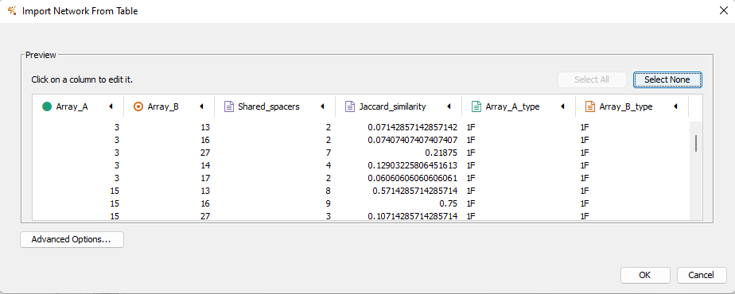
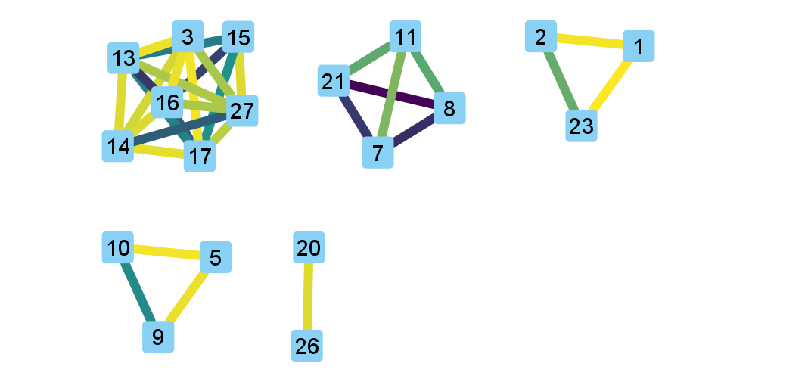

Tutorial
========

Data retrieval
^^^^^^^^^^^^^^

For this tutorial we will work through and analyze part of the dataset used in the CCTK publication, which is itself a subset of the data presented by `England et al., 2018 <https://doi.org/10.1128/mSystems.00075-18>`_. The example data used here are hosted on the `CCTK github page <https://github.com/Alan-Collins/CRISPR_comparison_toolkit>`_ and can be downloaded and extracted as follows:

.. code-block:: shell

	$ wget https://github.com/Alan-Collins/CRISPR_comparison_toolkit/raw/main/Example_data/Example_data.tar.gz -O - | tar -xz

This should download and extract a directory containing 10 *Pseudomonas aeruginosa* assemblies and some files we will use later. Each assembly filename corresponds to the `ENA <https://www.ebi.ac.uk/ena/browser/home>`_ sequence accession for the corresponding sequencing run. These assemblies were produced using `SPAdes <https://github.com/ablab/spades>`_.

.. code-block:: shell

	$ ls -1 Example_assemblies
	ERR431075.fasta
	ERR431089.fasta
	ERR431110.fasta
	ERR431125.fasta
	ERR431274.fasta
	ERR431323.fasta
	ERR431333.fasta
	ERR431387.fasta
	ERR431415.fasta
	ERR431427.fasta

Identifying CRISPR arrays
^^^^^^^^^^^^^^^^^^^^^^^^^

If you haven't already, install CCTK into a ``conda`` environment

.. code-block:: shell

	$ conda create -n cctk -c alan-collins cctk
	$ conda activate cctk

For this example, we will use both of the CRISPR identification tools included in CCTK to illustrate how they both work with the same input data. However, for simplicity, output from ``cctk minced`` will be used in subsequent analysis sections.

See the :ref:`minced-blast-comp` section for a discussion of how the output of ``cctk minced`` and ``cctk blast`` compare to get an idea of why you might choose one over the other.

Identifying CRISPR arrays using ``cctk minced``
"""""""""""""""""""""""""""""""""""""""""""""""

``cctk minced`` is the easier to use of the two CRISPR identification tools included in CCTK and is a good choice to start with. 

First, an important note: For many of the downstream analyses in CCTK, CRISPR array orientation is very important. It is therefore crucial that you know the sequence of CRISPR repeats in your assemblies in the correct orientation (i.e., leader end 5' of the repeat, trailer end 3'). If you do not yet know the correct orientation of your repeats, you can proceed with these analyses as ``cctk minced`` can identify CRISPR arrays with unknown repeats and will consistently orient them using a built-in database of repeats. However, you will want to come back and correctly orient your arrays before using the tools ``CRISPRtree`` or ``constrain``.

Setting up and running MinCED
#############################

``cctk minced`` uses `MinCED <https://github.com/ctSkennerton/minced>`_ to identify CRISPR arrays and then processes the output files produced by MinCED. ``cctk minced`` runs MinCED on all of the files in the input directory. In our case the directory is "Example_assemblies/". Before we run it, we'll make an directory to contain the output of ``cctk minced``, then we can run it. While `cctk minced` includes the three *P. aeruginosa* CRISPR types in its built-in database of repeats, we will provide them here to illustrate that step. They were included in the data you downloaded above: example_repeats.fna.

First let's just make a directory for the output and run the MinCED step. We could run everything in one step using ``-m -p``, but we will split it up here to go through the process in more detail.

.. code-block:: shell
	
	# Make output dir
	$ mkdir Minced_CRISPRs/

	# Run cctk minced
	$ cctk minced -i Example_assemblies/ -o Minced_CRISPRs/ -m

Exploring MinCED output before processing using ``cctk minced``
###############################################################

After a few seconds, you will see that a new directory has been created in the Minced_CRISPRs/ directory.

.. code-block:: shell

	$ ls Minced_CRISPRs/
	MINCED_OUT

This new directory contains all of the output files produced by MinCED. Each of these files is named using the base filename (i.e., excluding extension) of the input files, with "_minced_out.txt" added.

.. code-block:: shell

	$ ls -1 Minced_CRISPRs/MINCED_OUT/
	ERR431075_minced_out.txt
	ERR431089_minced_out.txt
	ERR431110_minced_out.txt
	ERR431125_minced_out.txt
	ERR431274_minced_out.txt
	ERR431323_minced_out.txt
	ERR431333_minced_out.txt
	ERR431387_minced_out.txt
	ERR431415_minced_out.txt
	ERR431427_minced_out.txt

These output files are the unaltered output produced by MinCED and are where ``cctk minced`` gets all the information it uses (except reference repeat sequences provided by the user). 

If you are working with assemblies with unknown repeats, you can easily extract a list of the repeats found by MinCED and count the number of times each repeat sequence occurs by pulling out nucleotide sequence from the repeat column in the MinCED output files. For the assemblies analyzed here, the following repeats were found:

.. code-block:: shell

	$ cut -f3 Minced_CRISPRs/MINCED_OUT/* | grep -Po "[ATCG]{15,100}" | sort | uniq -c | sort -k1 -nr
    127 GTTCACTGCCGTATAGGCAGCTAAGAAA
    123 TTTCTTAGCTGCCTACACGGCAGTGAAC
     99 TTTCTTAGCTGCCTATACGGCAGTGAAC
     26 GTTCACTGCCGTGTAGGCAGCTAAGAAA
     13 CGGTTCATCCCCACGCATGTGGGGAACAC
      8 CGGTTCATCCCCACACCCGTGGGGAACAC
      5 TTTCTTAGCTGCCTGTACGGCAGTGAAC
      5 TTTCACTGCCACATAGGTCGTCAAGAAA
      5 GTTCACTGCCGTACAGGCAGCTAAGAAA
      3 TTTCTTAGCTACCTATACGGCAGTGAAC
      3 GTTCACTGCCGTATAGGCAGCTAAAAAA
      2 TTTCTTGACGACCTATGTGGCAGTGAAA
      1 TTTTTTAGCTGCCTATACGGCAGTGAAC
      1 TTTCTTAGCTGCCTATACGGCAGTGGAC
      1 TTTCTTAGCGGCCTACACGGCAGTGAAC
      1 TTTCTTAACTGCCTATACGGCAGTGAAC
      1 TGGTTCATCCCCACGCATGTGGGGAACAC
      1 GTTCACTGCCGTGTAGGCCGCTAAGAAA
      1 GTTCACTGCCGTATCGGCAGCTAAGAAA
      1 GTTCACTGCCGTATAGGTAGCTAAGAAA
      1 GTTCACTGCCGTATAGGCAGCAAAAAAT
      1 GTTCACTGCCGTATAGGCAGCAAAAAAA
      1 GTCCACTGCCGTATAGGCAGCTAAGAAA
      1 CAGGTTTATCCCACGCCTGTGGGGGAACA
      1 CAGCTCATCCCCACGCCCGTGGGGAACAC
      1 ATTTTTTGCTGCCTATACGGCAGTGAAC

In the output returned by this command, the second column is the nucleotide sequence of each repeat found by MinCED, while the first column is the number of instances of that repeat that were found. Note that the first 2 lines are highly similar sequences that are in different orientations to one another. In fact the first 4 lines are minor variations on the same sequence. This highlights a weakness of MinCED that it is important to be aware of: it does not check the orientation of repeats so there is a roughly 50% chance that the repeat will be correctly oriented in any given sequence. 

``cctk minced`` attempts to consistently orient CRISPR arrays by comparing each query repeat to a built-in database of repeat sequences, or a user-provided database of repeats (reverse complement is also checked). If the query repeat matches best in the reverse complement then the entire corresponding array is reversed. Even if the specific repeat present in your assemblies is not in the built-in database, there is a good chance that all instances of that repeat (even with some SNPs) will match the same reference repeat, resulting in consistent (even if incorrect) orientation even for unknown repeats. We will discuss below what happens when repeats don't match well with any of the reference repeats used by ``cctk minced``

Processing MinCED output files
##############################

Now that we have briefly explored the output produced by MinCED, we will use ``cctk minced`` to process those output files. As we have already run MinCED, we don't need ``-m`` or to point ``cctk minced`` to our assemblies with ``-i``.

.. code-block:: shell
	
	$ cctk minced -o Minced_CRISPRs/ -p
	Total unique spacers: 244
	Total unique arrays: 21

``cctk minced`` outputs a summary of the number of unique spacers and CRISPR arrays identified to stderr. Output files produced here are described in the ``cctk minced`` :ref:`minced-output` section.

As we did not provide a file containing FASTA format CRISPR repeats, ``cctk minced`` uses the built-in database of CRISPR repeats (currently subtypes I-A, I-C, I-E, and I-F). The built-in database is fine for the assemblies used here as *P. aeruginosa* encodes CRISPR subtypes I-C, I-E, and I-F.

Note that each spacer has its predicted CRISPR subtype included in its FASTA header and this header is used as an identifier for each spacer in all other output files.

.. code-block:: shell

	$ head -4 Minced_CRISPRs/PROCESSED/CRISPR_spacers.fna
	>1F_1
	AAACTCATCAGGCACCGGCAGCGCAATCAACT
	>1F_2
	AAAGCGGGCATGACGTTCAACCCCAACAGCCG

Specifying expected repeat sequences
####################################

Now let's process the MinCED output using the example_repeats.fna file that we downloaded earlier. This file contains sequences for the three CRISPR subtypes found in *P. aeruginosa*, but the FASTA headers for those sequences differ from the IDs used in the built-in CRISPR database (e.g. "1F" above vs "I-F" in the example file):

.. code-block:: shell

	$ cat example_repeats.fna
	>I-C
	GTCGCGCCCCGCACGGGCGCGTGGATTGAAAC
	>I-E
	GTGTTCCCCACGGGTGTGGGGATGAACCG
	>I-F
	GTTCACTGCCGTGTAGGCAGCTAAGAAA

We run the processing steps again with these repeat sequences by providing them using ``-r``. Notice that providing repeat sequences does not change the number of spacers or arrays found. This is only used to decide which direction each array should be and to assign names to spacers.

.. code-block:: shell
	
	$ cctk minced -o Minced_CRISPRs/ -p -r example_repeats.fna
	Total unique spacers: 244
	Total unique arrays: 21

Rerunning processing steps will overwrite the existing files in the Minced_CRISPRs/PROCESSED/ directory. If you ever want to preserve the output from a processing run, you will need to rename the PROCESSED folder to something else to prevent the data being overwritten.

When repeats are provided as an input file, the built-in database of CRISPR repeats is not used. All identified CRISPR spacers will therefore be assigned subtypes with the IDs present in the provided file.

.. code-block:: shell

	$ head -4 Minced_CRISPRs/PROCESSED/CRISPR_spacers.fna
	>I-F_1
	AAACTCATCAGGCACCGGCAGCGCAATCAACT
	>I-F_2
	AAAGCGGGCATGACGTTCAACCCCAACAGCCG

What about if the repeats in the built-in database or in the file provided using ``-r`` are not the repeats present in our assemblies? Let's see.

The example assemblies we are working with here have mostly subtype I-F arrays and a few I-E arrays. Let's see what happens if we use a repeats file containing only the I-E repeat:

.. code-block:: shell
	
	# Use grep to find the line containing "I-E" and return that line and the line after
	$ grep -A1 "I-E" example_repeats.fna > 1E_repeat.fna
	$ cat 1E_repeat.fna
	>I-E
	GTGTTCCCCACGGGTGTGGGGATGAACCG
	
	# Now use the new 1E_repeat.fna file as input to cctk minced with -r
	$ cctk minced -o Minced_CRISPRs/ -p -r 1E_repeat.fna
	Total unique spacers: 244
	Total unique arrays: 21

Now if we have a look at our CRISPR spacers we will see that the first couple of spacers in our file, which were previously identified as subtype I-F, have a different header

.. code-block:: shell

	$ head -4 Minced_CRISPRs/PROCESSED/CRISPR_spacers.fna
	>unknown_CRISPR_type(I-E)_1
	AAAAAGCCCAGCTCGAAGGCTGGGCTTTTTCT
	>unknown_CRISPR_type(I-E)_2
	AAAGCCGGCCTCGCGCACCGACTTGGCAGCCT

When ``cctk minced`` finds that a repeat differs at more than 5 bases from any repeat in the database being used, that repeat is classified as unknown. When a repeat is classified as unknown, the most similar repeat subtype is included in parentheses in the ID for all spacers in the arrays with that repeat. As we only provided a repeat associated with subtype I-E, that repeat is the best matching and is therefore included in the header for all spacers.

Grouping very similar spacers based on SNPs
###########################################

Sometimes, due to the acquisiton of mutations, or sequencing errors, CRISPR spacers may be identified that differ only by one or two bases. If you wish spacers that differ by a small amount to be considered the same by ``cctk`` tools, then you can use ``cctk minced`` to identify groups of highly similar spacers and to assign them the same ID. This is done by using ``-s`` and providing an integer threshold defining the number of SNPs that can exist between to spacers for those spacers to be considered the same. The deafault behaviour of ``cctk minced`` is to consider spacers that differ by a single base to be different.

This process is performed during the processing steps performed by ``cctk minced`` and so we do not need to run MinCED again. Our command is therefore very similar to those above:

.. code-block:: shell

	# Consider spacers with 2 or fewer SNPs to be the same

	$ cctk minced -o Minced_CRISPRs/ -p -s 2
	Total unique spacers: 240
	Total unique arrays: 21

Note that the number of unique spacers identified is now 240 instead of 244. 

The spacers that have now been reduced to a single representetive are described in an output file that was not produced by previous runs: :ref:`spacer-cluster-reps`

.. code-block:: shell

	$ cat Minced_CRISPRs/PROCESSED/Spacer_cluster_members.txt
	1F_33   AGCCGATGGCCCGCAGTAGTACCCCGATTAGT
	1F_116  GCCCAGGCACGTTTGCTCGCGCTTTGATCTCA
	1F_192  GTCGCGAAGTTCATAAGCGGGCTTCGGGCGA TGTCCCGAAGTTCATAAGCGGGCTTCGGGCGA

Identifying CRISPR arrays using ``cctk blast``
""""""""""""""""""""""""""""""""""""""""""""""

Setting up
##########

Before we can run ``cctk blast`` we must first perform a few steps to prepare our sequences. ``cctk blast`` requires that we provide out input in the form of a blast database. 

As described in the ``cctk blast`` :ref:`blast-before-you-run` section, there are several requirements that your sequences must satisfy:

#. No pipe symbols ("|") in any of your fasta headers.
#. None of the fasta headers in the sequences are the same.
#. If your sequences are broken up into multiple contigs, ensure that each fasta header contains an identifier that can be used to associate the sequences.

The example sequences we are working with here were assembled using Spades, which produces assemblies with contig headers that can not be distinguished between files:

.. code-block:: shell

	$ head -1 Example_assemblies/* | head -5
	==> Example_assemblies/ERR431075.fasta <==
	>NODE_1_length_486033_cov_46.527666

	==> Example_assemblies/ERR431089.fasta <==
	>NODE_1_length_794353_cov_41.111729

If we were to combine these sequences into a single blast database, it would be laborious to later figure out which sequences came from which files. Instead, as each filename contains identifying information (the ERR accession number), we will add that accession to each fasta header in each file. This modification can be acheived with the following bash commands:

.. code-block:: shell
	
	$ for file in Example_assemblies/*; do id=${file%.*}; id=${id##*/}; sed -i "s/>/>${id}_/" $file; done

Now all of the fasta headers in our assembly files can easily be related back to the assembly to which they belong.

Now let's make a directory to contain our blastdb, combine our sequences, and make the bastabase:

.. code-block:: shell

	$ mkdir Blastdb
	$ cat Example_assemblies/* > all_assemblies.fna
	$ makeblastdb -in all_assemblies.fna -out Blastdb/assembly_db -dbtype nucl -parse_seqids

We are now ready to identify CRISPR arrays using ``cctk blast``.

Running ``cctk blast``
######################

First, make a folder to contain the outputs produced by ``cctk blast``. Then we can run it. We need to provide a description of an identifier that is present in all the fasta headers for a given assembly as our assemblies are all in multiple contigs. In our case that identifier is the ERR accession we added above. We will provide it as a regex here, but see the :ref:`blast-contig-ids` section of the `cctk blast <blast.html>`_ documentation page for a description of other options for how you can specify this information.

.. code-block:: shell
	
	# Make output dir
	$ mkdir Blast_CRISPRs

	# Run cctk blast
	$ cctk blast -d Blastdb/assembly_db -r example_repeats.fna -o Blast_CRISPRs/ -p "ERR\d+" -s 2
	Total unique spacers: 242
	Total unique arrays: 22

Note that ``cctk blast`` identifies a different number of spacers and a different number of arrays than ``cctk minced`` did. (242 vs 244 and 22 vs 21 when run without using ``-s``). A description of the differences between the two approaches that lead to these different outputs can be found in the :ref:`minced-blast-comp` section below.

``cctk blast`` can also use a SNP threshold to consider slightly different spacers to be the same, just like with ``cctk minced``. In addition, as most of the running time of ``cctk minced`` is spent running ``blastn`` using a BLASTdb followed by lots of ``blastdbcmd``, we can improve running time by using multiple threads for those two steps with ``-t``

.. code-block:: shell
	
	# Omit -t if you are on a computer with only 1 thread
	$ cctk blast -d Blastdb/assembly_db -r example_repeats.fna -o Blast_CRISPRs/ -p "ERR\d+" -s 2 -t 2

``cctk blast`` produces the same kind of outputs as ``cctk minced``. We can see the list of output files produced by each tool as a sort of table, with the ``cctk minced`` output in the left column and ``cctk blast`` output in the right column. The following command lists the contents of each output directory in separate columns with the name of the ``cctk`` tool that produced them as column headers:

.. code-block:: shell

	$ paste <(echo "Minced"; ls Minced_CRISPRs/PROCESSED/) <(echo "Blast"; ls Blast_CRISPRs/) | column -t
	Minced                      Blast
	Array_IDs.txt               Array_IDs.txt
	Array_locations.bed         Array_locations.bed
	Array_network.txt           Array_network.txt
	Array_representatives.txt   Array_representatives.txt
	Array_seqs.txt              Array_seqs.txt
	CRISPR_spacers.fna          CRISPR_spacers.fna
	CRISPR_summary_table.csv    CRISPR_summary_table.csv
	CRISPR_summary_table.txt    CRISPR_summary_table.txt
	Spacer_cluster_members.txt  Spacer_cluster_members.txt

.. _network-tutorial:

Exploring CRISPR array relationships using a network representation
"""""""""""""""""""""""""""""""""""""""""""""""""""""""""""""""""""

Now that we have predicted CRISPR arrays in the example assemblies, we can begin to explore the relationships between these arrays. We will first visualize array relationships as a network to see how arrays in this dataset are related on a broad scale, and then we will explore more closely the relationships between a small number of arrays. In the following example, we will use `Cytoscape <https://cytoscape.org/>`_ to visualize our array relationship network and will work with the data we generated using ``cctk minced``. We will refer to arrays within the network representation as "nodes" and the relationship between two arrays as an "edge".

Both ``cctk minced`` and ``cctk blast`` produced a file called :ref:`array-network` which can be read directly in to Cytoscape by simply clicking and dragging the file onto a Cytoscape window. You should then define the columns as in the following image (These definitions are used for applying styles according to node and edge attributes):

After importing the data, we can use styles to colour edges according to the number of spacers shared or the jaccard similarity between arrays to quickly get a sense of the relationships within each of our clusters. Below is an image showing the network with edges coloured according to the Jaccard similarity between each pair of nodes (darker colours indicate higher array similarity).

In this network representation of array relationships, it is clear that there are three distinct clusters of arrays. The left-most cluster containing arrays 2, 4, 7, 12, and 17 all have low similarity with one another, while the other two clusters contain some arrays that have a high similarity to one another. Any arrays that do not share any spacers with any other arrays in the dataset are not shown in this network. We will now look more closely at these three clusters using other CCTK tools.

.. _diffplot-tutorial:

Using CRISPRdiff to visualize array relationships
"""""""""""""""""""""""""""""""""""""""""""""""""

`CRISPRdiff <crisprdiff.html>`_ can be used to quickly and easily identify the spacers that are shared and distinct between CRISPR arrays. Here we will use it to visualise the three clusters of arrays that we saw in the :ref:`network-tutorial`. For this example we will create a directory within our Minced_CRISPRs/ directory and save plots at that location.

**N.B.** In the following sections, the spacers within arrays will be referred to using their index within the array and their colour. e.g. the leader-most (i.e., left-most) spacer in a given array is spacer 1, while the next spacer (2nd spacer) is spacer 2. From the trailer end, spacers will be numbered using negative numbers. E.g. the trailer-most (i.e., right-most) spacer is spacer -1, while the next spacer from the trailer end is -2 etc.

.. code-block:: shell

	Minced_CRISPRs$ mkdir Plots

First let's look at the left-most cluster in which all arrays have a low level of similarity to one another.

.. code-block:: shell

	Minced_CRISPRs$ cctk CRISPRdiff -a PROCESSED/Array_IDs.txt -o Plots/left_cluster.png 2 6 11 17 18

That produces a plot similar to that shown below (the below plot was generated using the additional option ``--plot-height 1.5`` to reduce vertical spacing).

.. image:: images/diff_tutorial_left.png

In the above image, it is clear that most spacers are not shared between arrays as they are depicted as thin, black rectangles. This is consistent with the network representation in which all the edges in this cluster have a light colour. In fact, all of the arrays in this cluster share their trailer-most spacer (spacer -1, cyan), but other spacers are either unique or only shared by a subset of arrays. This pattern may indicate that these arrays come from a common ancestral array that diverged long ago as only the presumably oldest spacer (trailer-most) is shared. 

Other interesting relationships are also clear. For example, Arrays 2 and 17 share a black spacer (-5 in array 7, -4 in array 4), which is surrounded on both sides by spacers that are not shared between these two arrays. Some possible explanations for this pattern of spacer sharing will be discussed below in the :ref:`tree-tutorial` section.

.. code-block:: shell

	Minced_CRISPRs$ cctk CRISPRdiff -a PROCESSED/Array_IDs.txt -o Plots/middle_cluster.png 5 12 20 21

.. image:: images/diff_tutorial_middle.png

.. code-block:: shell

	Minced_CRISPRs$ cctk CRISPRdiff -a PROCESSED/Array_IDs.txt -o Plots/right_cluster.png 7 8 9 15

.. image:: images/diff_tutorial_right.png

.. _tree-tutorial:

Using CRISPRtree to create hypotheses of array histories
""""""""""""""""""""""""""""""""""""""""""""""""""""""""

.. image:: images/tree_tutorial_left.png

.. _minced-blast-comp:

``cctk minced`` vs ``cctk blast`` output comparison
^^^^^^^^^^^^^^^^^^^^^^^^^^^^^^^^^^^^^^^^^^^^^^^^^^^

TO ADD
